# Frontend SDLC Workflow Pipelines with AI Tools Integration

## Table of Contents

1. [Overview](#overview)
2. [Complete SDLC Workflow Pipeline](#complete-sdlc-workflow-pipeline)
3. [Daily Workflow Integration](#daily-workflow-integration)
4. [AI Tools Benefits by SDLC Phase](#ai-tools-benefits-by-sdlc-phase)
5. [Practical Implementation Guide](#practical-implementation-guide)
6. [Team Adoption Strategy](#team-adoption-strategy)
7. [Measuring Success](#measuring-success)

---

## Overview

Frontend development in modern organizations requires structured workflow pipelines that integrate seamlessly with the Software Development Life Cycle (SDLC). This guide demonstrates how to create efficient workflow pipelines while leveraging AI tools like Cursor and OpenAI Codex to maximize productivity and code quality.

### Key Benefits of AI-Integrated SDLC Pipelines:

- **60-80% reduction** in boilerplate code development time
- **40-50% improvement** in bug detection and resolution
- **30-40% enhancement** in code review efficiency
- **50-70% faster** documentation creation
- **25-35% improvement** in overall development velocity

### Complete Workflow Visualization:

```mermaid
graph TD
    A["📋 Planning Phase<br/>Requirements Analysis<br/>Architecture Design"] --> B["🎨 Design Phase<br/>UI/UX Specs<br/>Component Design"]
    B --> C["💻 Development Phase<br/>Feature Implementation<br/>Code Generation"]
    C --> D["🧪 Testing Phase<br/>Unit/Integration Tests<br/>Quality Assurance"]
    D --> E["👥 Review Phase<br/>Code Review<br/>Peer Feedback"]
    E --> F["🚀 Deployment Phase<br/>Build & Deploy<br/>Monitoring"]

    A --> G["🤖 AI Planning<br/>Story Analysis<br/>Task Estimation"]
    B --> H["🤖 AI Design<br/>Component Generation<br/>Pattern Suggestions"]
    C --> I["🤖 AI Development<br/>Code Generation<br/>Bug Detection"]
    D --> J["🤖 AI Testing<br/>Test Generation<br/>Coverage Analysis"]
    E --> K["🤖 AI Review<br/>Quality Analysis<br/>Security Scan"]
    F --> L["🤖 AI Deployment<br/>Optimization<br/>Performance Monitoring"]

    G --> A
    H --> B
    I --> C
    J --> D
    K --> E
    L --> F

    style A fill:#e1f5fe
    style B fill:#f3e5f5
    style C fill:#e8f5e8
    style D fill:#fff3e0
    style E fill:#fce4ec
    style F fill:#f1f8e9
    style G fill:#bbdefb
    style H fill:#d1c4e9
    style I fill:#c8e6c8
    style J fill:#ffcc80
    style K fill:#f8bbd9
    style L fill:#dcedc8
```



This diagram illustrates how AI tools integrate seamlessly with each phase of the traditional SDLC, creating a bidirectional flow where AI assistance enhances every step while learning from the development process.

### Animated Workflow Visualization

For a complete understanding of the workflow, here's a detailed step-by-step visualization that can be animated:

#### GIF Visualization Specification

**Recommended GIF Creation Tools:**

- Figma with timeline animations
- Adobe After Effects
- Lottie animations
- Online tools like Canva or Giphy

**Animation Sequence (30-45 seconds total):**

```mermaid
sequenceDiagram
    participant Dev as 👨‍💻 Developer
    participant AI as 🤖 AI Assistant
    participant Code as 📝 Codebase
    participant Review as 👥 Review Team
    participant Deploy as 🚀 Deployment

    Note over Dev,Deploy: Morning Setup (0-3 seconds)
    Dev->>AI: Daily planning request
    AI->>Dev: Priority tasks & blockers

    Note over Dev,Deploy: Planning Phase (3-8 seconds)
    Dev->>AI: User story analysis
    AI->>Dev: Component breakdown
    AI->>Dev: Architecture suggestions
    Dev->>Code: Create feature branch

    Note over Dev,Deploy: Development Phase (8-20 seconds)
    Dev->>AI: Component generation request
    AI->>Code: Generate component structure
    Dev->>AI: Implementation assistance
    AI->>Code: Add TypeScript types
    AI->>Code: Add error handling
    AI->>Code: Add accessibility features

    Note over Dev,Deploy: Testing Phase (20-28 seconds)
    Dev->>AI: Test generation request
    AI->>Code: Generate unit tests
    AI->>Code: Generate integration tests
    AI->>Dev: Coverage analysis

    Note over Dev,Deploy: Review Phase (28-35 seconds)
    Dev->>Review: Create pull request
    AI->>Review: Automated code analysis
    Review->>Dev: Feedback & approval

    Note over Dev,Deploy: Deployment Phase (35-40 seconds)
    Dev->>AI: Pre-deployment checklist
    AI->>Deploy: Bundle optimization
    Deploy->>AI: Performance monitoring

    Note over Dev,Deploy: End of Day (40-45 seconds)
    AI->>Dev: Progress summary
    Dev->>AI: Tomorrow's priorities
```



#### Frame-by-Frame GIF Storyboard

**Frame 1-3 (0-3s): Morning Setup**

```
🌅 Morning Setup
┌─────────────────────────┐
│ 👨‍💻 Developer starts day │
│ 🤖 AI analyzes context  │
│ 📊 Shows daily metrics  │
└─────────────────────────┘
```

**Frame 4-8 (3-8s): Planning Phase**

```
📋 Planning Phase
┌─────────────────────────┐
│ 📖 User story input     │
│ 🤖 AI breaks down tasks │
│ 🏗️ Architecture design  │
│ 🌿 Branch creation      │
└─────────────────────────┘
```

**Frame 9-20 (8-20s): Development Phase**

```
💻 Development Phase
┌─────────────────────────┐
│ ⚡ Component generation │
│ 🔧 TypeScript typing   │
│ 🛡️ Error handling      │
│ ♿ Accessibility        │
│ 🎨 Styling & responsive │
└─────────────────────────┘
```

**Frame 21-28 (20-28s): Testing Phase**

```
🧪 Testing Phase
┌─────────────────────────┐
│ ✅ Unit test generation │
│ 🔗 Integration testing  │
│ 📊 Coverage analysis    │
│ 🐛 Bug detection       │
└─────────────────────────┘
```

**Frame 29-35 (28-35s): Review Phase**

```
👥 Review Phase
┌─────────────────────────┐
│ 📤 Pull request created │
│ 🤖 AI code analysis     │
│ 👀 Peer review         │
│ ✅ Approval & merge     │
└─────────────────────────┘
```

**Frame 36-40 (35-40s): Deployment Phase**

```
🚀 Deployment Phase
┌─────────────────────────┐
│ 📦 Bundle optimization  │
│ 🚀 Production deploy    │
│ 📈 Performance monitor  │
│ 🎯 Success metrics     │
└─────────────────────────┘
```

**Frame 41-45 (40-45s): Day Summary**

```
🌆 Day Summary
┌─────────────────────────┐
│ 📊 Progress metrics     │
│ 🎯 Goals achieved      │
│ 🔄 Tomorrow's prep     │
│ 💡 Learnings captured  │
└─────────────────────────┘
```

### Interactive Workflow Timeline


### Workflow Metrics Visualization


### Tools Integration Flow


### Creating Your Own Animated GIF

**Step-by-Step Guide:**

1. **Design Tool Setup:**

   ```bash
   # Recommended tools
   - Figma (Free) - figma.com
   - Canva (Free/Paid) - canva.com
   - Adobe After Effects (Paid)
   - LottieFiles (Free) - lottiefiles.com
   ```

2. **Animation Elements:**

   ```
   Icons needed:
   - 👨‍💻 Developer
   - 🤖 AI Assistant
   - 📝 Code Editor
   - 🔧 Tools
   - 🧪 Testing
   - 👥 Team
   - 🚀 Deployment
   - 📊 Metrics
   ```

3. **Color Scheme:**

   ```css
   :root {
     --planning: #e1f5fe;
     --design: #f3e5f5;
     --development: #e8f5e8;
     --testing: #fff3e0;
     --review: #fce4ec;
     --deployment: #f1f8e9;
     --ai-accent: #ff6b6b;
   }
   ```

4. **Animation Timing:**
   ```
   Total Duration: 45 seconds
   - Smooth transitions: 0.5s between phases
   - Phase duration: 5-12s each
   - Loop pause: 2s before restart
   - Easing: ease-in-out for smooth flow
   ```

### Live Workflow Dashboard Concept

For a real-time implementation, consider creating a live dashboard that shows:


---

## Complete SDLC Workflow Pipeline

### 1. Planning & Requirements Phase

#### Workflow Pipeline Steps:


#### AI Tools Integration:

**Cursor AI Prompts for Planning:**

```javascript
// Requirements Analysis
"Analyze this user story for a frontend implementation:

User Story: '${userStory}'

Provide:
1. Component breakdown using atomic design
2. State management requirements
3. API integration points
4. Performance considerations
5. Accessibility requirements
6. Testing strategy
7. Estimated complexity and timeline

Context: React TypeScript app with ${techStack}"
```

**OpenAI Codex for Architecture:**

```javascript
// Architecture Planning
"Design a scalable frontend architecture for:

Application: ${appDescription}
User Base: ${userBase}
Key Features: ${features}
Performance Requirements: ${performance}
Scalability Needs: ${scalability}

Suggest:
- Component architecture
- State management pattern
- Code splitting strategy
- Performance optimization approach
- Testing architecture"
```

### 2. Design & Prototyping Phase

#### Workflow Pipeline Steps:


#### AI-Powered Design Implementation:

```javascript
// Component Design Generation
"Create a React component specification for:

Design: ${designDescription}
Behavior: ${behaviorRequirements}
Interactions: ${interactionList}

Generate:
- TypeScript interface definitions
- Component structure
- Props specifications
- Event handlers
- Accessibility requirements
- Responsive design approach

Follow our design system: ${designSystemReference}"
```

### 3. Development Phase

#### Workflow Pipeline Steps:


#### Daily Development Workflow:

**Morning Setup (15-20 minutes):**

```bash
# Daily standup integration with AI
"Review yesterday's commits and suggest today's priorities:

Commits: ${yesterdayCommits}
Sprint Goals: ${sprintGoals}
Current Issues: ${issuesList}

Suggest:
1. Priority tasks for today
2. Potential blockers to address
3. Collaboration opportunities
4. Technical debt to tackle"
```

**Feature Development (Core Development Time):**

```javascript
// Step 1: Component Architecture
"Design ${componentName} with these requirements:
${requirements}

Provide:
- Component structure
- Props interface
- State management approach
- Event handling strategy
- Performance considerations"

// Step 2: Implementation
"Implement ${componentName} with:
- TypeScript strict mode
- Responsive design
- Accessibility features
- Error handling
- Loading states
- Unit tests"

// Step 3: Integration
"Integrate ${componentName} with:
- Redux store
- API endpoints
- Parent components
- Routing system
- Error boundaries"
```

**End-of-Day Review (10-15 minutes):**

```javascript
// Daily progress review
"Review today's development progress:

Completed: ${completedTasks}
In Progress: ${inProgressTasks}
Blockers: ${blockers}

Analyze:
1. Code quality metrics
2. Test coverage
3. Performance implications
4. Documentation needs
5. Tomorrow's priorities"
```

### 4. Testing Phase

#### Workflow Pipeline Steps:


#### AI-Powered Testing Strategy:

```javascript
// Comprehensive Test Generation
"Generate comprehensive tests for ${componentName}:

Component Code: ${componentCode}

Test Categories:
1. Unit tests (Jest + RTL)
   - Rendering tests
   - User interaction tests
   - Edge cases
   - Error handling

2. Integration tests
   - API integration
   - State management
   - Component communication

3. Accessibility tests
   - ARIA compliance
   - Keyboard navigation
   - Screen reader compatibility

4. Performance tests
   - Rendering performance
   - Memory usage
   - Bundle size impact

Provide complete test files with setup and teardown."
```

### 5. Code Review Phase

#### Workflow Pipeline Steps:


#### AI-Enhanced Code Review:

```javascript
// Pre-Review Analysis
"Perform comprehensive code review for this PR:

Files Changed: ${changedFiles}
Changes Summary: ${changesSummary}

Review for:
1. Code quality and consistency
2. Performance implications
3. Security vulnerabilities
4. Accessibility compliance
5. Test coverage adequacy
6. Documentation completeness
7. Breaking changes impact
8. Best practices adherence

Team Standards:
- TypeScript strict mode
- Functional components
- Atomic design principles
- 80%+ test coverage
- WCAG 2.1 AA compliance"
```

### 6. Deployment Phase

#### Workflow Pipeline Steps:


#### AI-Powered Deployment:

```javascript
// Pre-Deployment Checklist
"Prepare deployment checklist for release:

Release Version: ${version}
Changes: ${changesList}
Environment: ${environment}

Verify:
1. Bundle size analysis
2. Performance regression check
3. Browser compatibility
4. SEO implications
5. Analytics tracking
6. Feature flag configurations
7. Rollback procedures
8. Monitoring setup

Generate deployment commands and rollback scripts."
```

---

## Daily Workflow Integration

### Morning Routine (30 minutes)

```bash
# 1. Daily Planning (10 minutes)
"Plan today's development tasks:

Sprint Goal: ${sprintGoal}
Yesterday's Progress: ${yesterdayProgress}
Today's Capacity: ${todayCapacity}
Blockers: ${blockers}

Suggest:
- Priority tasks
- Time estimates
- Collaboration needs
- Potential risks"

# 2. Environment Setup (10 minutes)
"Review development environment status:

Branch: ${currentBranch}
Pending Changes: ${pendingChanges}
Dependencies: ${dependencyStatus}

Provide:
- Setup commands
- Dependency updates
- Configuration changes
- Environment health check"

# 3. Code Quality Review (10 minutes)
"Analyze current code quality metrics:

Test Coverage: ${testCoverage}
Code Quality Score: ${qualityScore}
Performance Metrics: ${performanceMetrics}
Security Scan Results: ${securityResults}

Suggest improvements and priorities."
```

### Development Flow (Core Hours)

```javascript
// Feature Development Cycle (Repeat 2-3 times daily)

// 1. Requirement Analysis (15 minutes)
"Analyze feature requirement:
${featureRequirement}

Break down into:
- Components needed
- State management
- API integration
- Testing requirements
- Performance considerations"

// 2. Implementation (60-90 minutes)
"Implement ${featureName}:

Requirements: ${requirements}
Constraints: ${constraints}
Dependencies: ${dependencies}

Generate production-ready code with:
- TypeScript types
- Error handling
- Loading states
- Accessibility
- Unit tests"

// 3. Testing & Review (30 minutes)
"Test and validate ${featureName}:

Test scenarios:
- Happy path
- Error conditions
- Edge cases
- Performance
- Accessibility

Generate test files and validation scripts."
```

### End-of-Day Review (20 minutes)

```javascript
// Daily Wrap-up
"Summarize today's development:

Completed: ${completedTasks}
In Progress: ${inProgressTasks}
Blockers: ${blockers}
Learnings: ${learnings}

Analyze:
1. Productivity metrics
2. Code quality impact
3. Technical debt introduced
4. Tomorrow's priorities
5. Team collaboration points

Generate progress report and handoff notes."
```

---

## AI Tools Benefits by SDLC Phase

### Planning Phase Benefits

| Activity              | Traditional Time | With AI       | Time Saved | Quality Improvement |
| --------------------- | ---------------- | ------------- | ---------- | ------------------- |
| Requirements Analysis | 2-3 hours        | 45-60 minutes | 60-70%     | Higher accuracy     |
| Architecture Planning | 4-6 hours        | 1-2 hours     | 70-75%     | Better patterns     |
| Task Estimation       | 1-2 hours        | 20-30 minutes | 75-80%     | More accurate       |
| Documentation         | 2-3 hours        | 30-45 minutes | 80-85%     | More comprehensive  |

### Development Phase Benefits

| Activity           | Traditional Time | With AI       | Time Saved | Quality Improvement   |
| ------------------ | ---------------- | ------------- | ---------- | --------------------- |
| Component Creation | 2-4 hours        | 30-60 minutes | 70-85%     | Better structure      |
| State Management   | 3-5 hours        | 1-2 hours     | 60-70%     | Cleaner patterns      |
| API Integration    | 2-3 hours        | 45-90 minutes | 50-60%     | Better error handling |
| Testing            | 3-4 hours        | 1-2 hours     | 60-70%     | More comprehensive    |

### Review Phase Benefits

| Activity             | Traditional Time | With AI       | Time Saved | Quality Improvement |
| -------------------- | ---------------- | ------------- | ---------- | ------------------- |
| Code Review          | 1-2 hours        | 30-45 minutes | 50-65%     | More thorough       |
| Bug Detection        | 2-3 hours        | 45-60 minutes | 60-70%     | Earlier detection   |
| Performance Analysis | 2-4 hours        | 1-2 hours     | 50-60%     | Better insights     |
| Security Review      | 1-2 hours        | 20-30 minutes | 70-80%     | More comprehensive  |

---

## Practical Implementation Guide

### Week 1: Foundation Setup

**Day 1-2: Tool Installation & Configuration**

```bash
# Cursor AI Setup
1. Install Cursor AI from https://cursor.sh/
2. Configure team settings
3. Install essential extensions
4. Set up shared prompts library

# OpenAI Codex Setup
1. Configure API access
2. Set up development environment
3. Install necessary integrations
4. Configure team guidelines
```

**Day 3-5: Team Training & Onboarding**

```javascript
// Training Schedule
"Create training plan for team of ${teamSize} developers:

Team Experience:
- React: ${reactExperience}
- TypeScript: ${typescriptExperience}
- AI Tools: ${aiExperience}

Training Modules:
1. AI tools overview
2. Prompt engineering
3. Code generation best practices
4. Integration workflows
5. Quality assurance

Provide:
- Training schedule
- Hands-on exercises
- Assessment criteria
- Success metrics"
```

### Week 2: Workflow Integration

**Day 1-3: Pilot Project**

```javascript
// Pilot Project Setup
"Design pilot project for AI tools integration:

Project Size: Small to medium feature
Team Size: 2-3 developers
Duration: 1 week
Scope: ${projectScope}

Goals:
- Test AI integration
- Measure productivity gains
- Identify challenges
- Refine workflows

Provide project plan and success metrics."
```

**Day 4-5: Workflow Refinement**

```javascript
// Workflow Optimization
"Analyze pilot project results:

Metrics: ${projectMetrics}
Feedback: ${teamFeedback}
Challenges: ${challenges}
Successes: ${successes}

Optimize:
1. Workflow processes
2. Prompt templates
3. Integration points
4. Quality checks
5. Team practices

Provide refined workflow documentation."
```

### Week 3-4: Full Implementation

**Gradual Rollout Strategy:**

```javascript
// Rollout Plan
"Create rollout plan for full team adoption:

Team Structure: ${teamStructure}
Current Processes: ${currentProcesses}
Integration Points: ${integrationPoints}

Rollout Phases:
1. Core team adoption (Week 3)
2. Extended team training (Week 4)
3. Process standardization (Week 5)
4. Full implementation (Week 6)

Provide:
- Detailed timeline
- Training materials
- Support structure
- Success metrics"
```

---

## Team Adoption Strategy

### Leadership Buy-in

```javascript
// Executive Presentation
"Create executive presentation for AI tools adoption:

Current State:
- Development velocity: ${currentVelocity}
- Code quality metrics: ${qualityMetrics}
- Team satisfaction: ${teamSatisfaction}
- Delivery timelines: ${deliveryTimelines}

Proposed Benefits:
- Productivity improvement: 40-60%
- Quality enhancement: 30-40%
- Time to market: 25-35% faster
- Developer satisfaction: Higher

Investment Required:
- Tool licenses: ${toolCosts}
- Training time: ${trainingHours}
- Setup effort: ${setupEffort}

ROI Timeline: ${roiTimeline}

Provide business case and implementation roadmap."
```

### Developer Onboarding

```javascript
// Developer Onboarding Program
"Design onboarding program for developers:

Experience Levels:
- Junior: ${juniorCount}
- Mid-level: ${midCount}
- Senior: ${seniorCount}

Training Modules:
1. AI tools introduction
2. Prompt engineering
3. Code generation
4. Quality assurance
5. Best practices

Provide:
- Training schedule
- Hands-on exercises
- Certification process
- Ongoing support plan"
```

### Success Metrics

### Productivity Metrics

```javascript
// Productivity Tracking
"Design productivity tracking system:

Metrics to Track:
1. Development velocity
   - Story points per sprint
   - Features delivered per month
   - Bug resolution time

2. Code Quality
   - Test coverage percentage
   - Code review time
   - Bug density

3. Developer Experience
   - Time to complete tasks
   - Code reusability
   - Learning curve

4. Business Impact
   - Time to market
   - Customer satisfaction
   - Revenue impact

Provide tracking dashboard and reporting structure."
```

### Quality Metrics

| Metric                 | Before AI        | After AI         | Improvement |
| ---------------------- | ---------------- | ---------------- | ----------- |
| Test Coverage          | 65-70%           | 85-90%           | 20-25%      |
| Code Review Time       | 2-3 hours        | 45-60 minutes    | 60-70%      |
| Bug Density            | 0.8-1.2 per KLOC | 0.3-0.5 per KLOC | 60-70%      |
| Documentation Coverage | 40-50%           | 85-95%           | 80-90%      |

---

## Measuring Success

### KPIs for AI Integration

```javascript
// KPI Dashboard
"Create KPI dashboard for AI tools integration:

Development Metrics:
- Lines of code per hour
- Features completed per sprint
- Bug resolution time
- Code review duration

Quality Metrics:
- Test coverage percentage
- Code quality score
- Security vulnerability count
- Performance optimization gains

Team Metrics:
- Developer satisfaction score
- Learning curve reduction
- Collaboration improvement
- Knowledge sharing increase

Business Metrics:
- Time to market reduction
- Customer satisfaction improvement
- Revenue impact
- Cost savings

Provide dashboard design and reporting schedule."
```

### Continuous Improvement

```javascript
// Improvement Process
"Design continuous improvement process:

Review Cycles:
- Weekly: Team retrospectives
- Monthly: Metrics analysis
- Quarterly: Process optimization
- Annually: Strategy review

Improvement Areas:
1. Workflow efficiency
2. Tool utilization
3. Quality processes
4. Team collaboration
5. Knowledge management

Provide:
- Review templates
- Improvement tracking
- Success criteria
- Action planning process"
```

---

## Conclusion

Implementing AI-integrated SDLC workflow pipelines in frontend development delivers significant productivity gains while maintaining high code quality standards. The key to success lies in:

1. **Structured Implementation**: Follow the phased approach outlined in this guide
2. **Team Engagement**: Ensure proper training and support for all team members
3. **Continuous Optimization**: Regularly review and refine workflows based on metrics and feedback
4. **Quality Focus**: Maintain high standards while leveraging AI assistance
5. **Measurable Results**: Track success through comprehensive metrics and KPIs

By following this guide, frontend teams can achieve 40-60% productivity improvements while delivering higher quality code and improved developer satisfaction.
