# AI Code Security & Validation Guide for Frontend Development

## Table of Contents

1. [Overview](#overview)
2. [Security Validation Framework](#security-validation-framework)
3. [Code Quality Validation](#code-quality-validation)
4. [Integration with SDLC Workflow](#integration-with-sdlc-workflow)
5. [Automated Validation Pipeline](#automated-validation-pipeline)
6. [Security Best Practices](#security-best-practices)
7. [Validation Checklist](#validation-checklist)
8. [Tools and Implementation](#tools-and-implementation)
9. [Team Guidelines](#team-guidelines)

---

## Overview

AI tools like Cursor AI and OpenAI Codex can significantly accelerate frontend development, but **AI-generated code requires rigorous validation and security checks**. This guide provides a comprehensive framework for ensuring that AI-generated code meets security, quality, and compliance standards.

### **Critical Security Risks in AI-Generated Code:**

- **🚨 Injection Vulnerabilities**: XSS, SQL injection, and command injection
- **🔓 Authentication Bypasses**: Weak or missing authentication logic
- **💾 Data Exposure**: Sensitive information leakage
- **🌐 API Security Issues**: Insecure API calls and data handling
- **⚠️ Input Validation**: Missing or inadequate input sanitization
- **🔒 Authorization Flaws**: Improper access control implementation

### **Quality Risks:**

- **🐛 Logic Errors**: Incorrect business logic implementation
- **⚡ Performance Issues**: Inefficient algorithms and resource usage
- **♿ Accessibility Gaps**: Missing ARIA labels and keyboard navigation
- **📱 Responsive Issues**: Poor mobile and cross-browser compatibility
- **🧪 Test Coverage**: Inadequate or incorrect test scenarios

---

## Security Validation Framework

### **Multi-Layer Validation Approach**

```mermaid
graph TD
    subgraph AI_GENERATION ["🤖 AI Code Generation"]
        A1[Cursor AI Code]
        A2[OpenAI Codex Output]
        A3[Component Generation]
    end

    subgraph IMMEDIATE_VALIDATION ["⚡ Immediate Validation (Real-time)"]
        I1[🔍 Syntax Check]
        I2[🛡️ Security Pattern Scan]
        I3[📋 Code Style Validation]
        I4[🎯 Type Safety Check]
    end

    subgraph AUTOMATED_VALIDATION ["🤖 Automated Validation (Pre-commit)"]
        V1[🔒 Security Scanner<br/>SAST/DAST Tools]
        V2[🧪 Test Generation<br/>Coverage Validation]
        V3[♿ Accessibility Check<br/>ARIA/WCAG Compliance]
        V4[⚡ Performance Analysis<br/>Bundle Size/Speed]
        V5[🌐 API Security<br/>Request/Response Validation]
    end

    subgraph HUMAN_VALIDATION ["👥 Human Validation (Code Review)"]
        H1[🎯 Business Logic Review]
        H2[🔐 Security Expert Review]
        H3[♿ Accessibility Expert Review]
        H4[📊 Performance Review]
        H5[🏗️ Architecture Review]
    end

    subgraph PRODUCTION_VALIDATION ["🚀 Production Validation (Runtime)"]
        P1[📊 Security Monitoring]
        P2[⚡ Performance Monitoring]
        P3[🐛 Error Tracking]
        P4[🔍 Security Incident Detection]
    end

    %% Flow connections
    A1 --> I1
    A2 --> I2
    A3 --> I3

    I1 --> V1
    I2 --> V2
    I3 --> V3
    I4 --> V4

    V1 --> H1
    V2 --> H2
    V3 --> H3
    V4 --> H4
    V5 --> H5

    H1 --> P1
    H2 --> P2
    H3 --> P3
    H4 --> P4
    H5 --> P1

    %% Styling
    classDef aiBox fill:#fff3e0,stroke:#f57c00,stroke-width:2px,color:#000
    classDef immediateBox fill:#e8f5e8,stroke:#2e7d32,stroke-width:2px,color:#000
    classDef autoBox fill:#e3f2fd,stroke:#1565c0,stroke-width:2px,color:#000
    classDef humanBox fill:#fce4ec,stroke:#ad1457,stroke-width:2px,color:#000
    classDef prodBox fill:#f3e5f5,stroke:#6a1b9a,stroke-width:2px,color:#000

    class A1,A2,A3 aiBox
    class I1,I2,I3,I4 immediateBox
    class V1,V2,V3,V4,V5 autoBox
    class H1,H2,H3,H4,H5 humanBox
    class P1,P2,P3,P4 prodBox
```



### **Validation Checkpoints Integration**

| **Validation Layer** | **Triggers**    | **Time Investment** | **Risk Reduction** |
| -------------------- | --------------- | ------------------- | ------------------ |
| **Immediate**        | Every AI output | 30 seconds          | 40%                |
| **Automated**        | Pre-commit/PR   | 2-5 minutes         | 70%                |
| **Human Review**     | Code review     | 10-20 minutes       | 90%                |
| **Production**       | Runtime         | Continuous          | 95%                |

---

## Code Quality Validation

### **1. Security Validation Rules**

#### **🚨 Critical Security Checks (Automatic Failure)**

```typescript
// ❌ NEVER ALLOW: Direct innerHTML without sanitization
element.innerHTML = userInput; // BLOCKED

// ✅ REQUIRED: Proper sanitization
import DOMPurify from "dompurify";
element.innerHTML = DOMPurify.sanitize(userInput);

// ❌ NEVER ALLOW: Direct eval() usage
eval(userCode); // BLOCKED

// ❌ NEVER ALLOW: Hardcoded secrets
const API_KEY = "sk-1234567890abcdef"; // BLOCKED

// ✅ REQUIRED: Environment variables
const API_KEY = process.env.REACT_APP_API_KEY;

// ❌ NEVER ALLOW: Unsafe URL construction
window.location.href = userInput; // BLOCKED

// ✅ REQUIRED: URL validation
import { isValidURL } from "@/utils/validation";
if (isValidURL(userInput)) {
  window.location.href = userInput;
}
```

#### **⚠️ Warning-Level Security Checks**

```typescript
// ⚠️ WARNING: Missing input validation
const handleUserInput = (input: string) => {
  // VALIDATION REQUIRED
  if (!input || input.length > 1000) {
    throw new Error("Invalid input");
  }
  // Process input...
};

// ⚠️ WARNING: Missing error handling
const fetchUserData = async (userId: string) => {
  try {
    const response = await api.getUser(userId);
    return response.data;
  } catch (error) {
    // ERROR HANDLING REQUIRED
    console.error("Failed to fetch user:", error);
    throw error;
  }
};
```

### **2. TypeScript & Type Safety Validation**

```typescript
// ✅ ENFORCED: Strict type definitions
interface UserData {
  id: string;
  name: string;
  email: string;
  permissions: Permission[];
}

// ✅ ENFORCED: Input validation with types
const validateUserInput = (data: unknown): UserData => {
  if (!isUserData(data)) {
    throw new ValidationError("Invalid user data format");
  }
  return data;
};

// ✅ ENFORCED: API response validation
const fetchUser = async (id: string): Promise<UserData> => {
  const response = await api.get(`/users/${id}`);
  return validateUserInput(response.data);
};
```

### **3. Performance Validation Rules**

```typescript
// ⚠️ WARNING: Missing React.memo for expensive components
const ExpensiveComponent = React.memo(({ data }: Props) => {
  // Heavy computation here
});

// ⚠️ WARNING: Missing useMemo for expensive calculations
const ExpensiveCalculation = ({ items }: Props) => {
  const result = useMemo(() => {
    return items.reduce((acc, item) => acc + item.value, 0);
  }, [items]);
};

// ⚠️ WARNING: Missing useCallback for event handlers
const ComponentWithHandlers = ({ onUpdate }: Props) => {
  const handleClick = useCallback(() => {
    onUpdate();
  }, [onUpdate]);
};
```

---

## Integration with SDLC Workflow

### **Enhanced SDLC with Security Validation**

```mermaid
graph TD
    %% Original phases with security integration
    A[🌅 Morning Setup<br/>+ Security Tool Check] --> B[📋 Planning Phase<br/>+ Threat Modeling]

    B --> B1[📖 User Story Analysis<br/>+ Security Requirements]
    B1 --> B2[🤖 AI Requirements Analysis<br/>+ Security Pattern Check]
    B2 --> B3[📐 Technical Requirements<br/>+ Security Architecture]
    B3 --> C[🎨 Design Phase<br/>+ Security Design Review]

    C --> C1[🎨 UI/UX Design Review<br/>+ Security UX Patterns]
    C1 --> C2[🤖 AI Component Design<br/>+ Security Component Check]
    C2 --> C3[🧩 Component Specifications<br/>+ Security Validation]
    C3 --> D[💻 Development Phase<br/>+ Secure Coding]

    D --> D1[🌿 Feature Branch Creation<br/>+ Security Branch Policy]
    D1 --> D2[🤖 AI Code Generation<br/>+ Real-time Security Scan]
    D2 --> D3[⚡ Component Development<br/>+ Security Implementation]
    D3 --> D4[🎯 Error Handling<br/>+ Security Error Handling]
    D4 --> E[🧪 Testing Phase<br/>+ Security Testing]

    E --> E1[🧪 Unit Testing<br/>+ Security Unit Tests]
    E1 --> E2[🤖 AI Test Generation<br/>+ Security Test Validation]
    E2 --> E3[🔗 Integration Testing<br/>+ Security Integration Tests]
    E3 --> E4[♿ Accessibility Testing<br/>+ Security Accessibility]
    E4 --> F[👥 Review Phase<br/>+ Security Review]

    F --> F1[📤 Pull Request Creation<br/>+ Security PR Template]
    F1 --> F2[🤖 AI Code Review<br/>+ Automated Security Scan]
    F2 --> F3[👀 Peer Review<br/>+ Security Expert Review]
    F3 --> F4{✅ Security Approved?}
    F4 -->|No| SEC_FIX[🔧 Security Fix Required]
    SEC_FIX --> D3
    F4 -->|Yes| G[🚀 Deployment Phase<br/>+ Security Deployment]

    G --> G1[📦 Build Process<br/>+ Security Build Check]
    G1 --> G2[🤖 AI Deployment Check<br/>+ Security Gate Validation]
    G2 --> G3[🎯 Staging Deployment<br/>+ Security Staging Test]
    G3 --> G4[🚀 Production Deployment<br/>+ Security Monitoring]
    G4 --> H[📊 End of Day Review<br/>+ Security Metrics]

    %% Security-specific validation points
    subgraph SECURITY_GATES ["🔒 Security Gates"]
        SG1[🔍 Code Scanning<br/>SAST/DAST/SCA]
        SG2[🛡️ Vulnerability Assessment<br/>Dependency Check]
        SG3[🎯 Penetration Testing<br/>Security Validation]
        SG4[📊 Security Metrics<br/>Risk Assessment]
    end

    %% Security tool integrations
    subgraph SECURITY_TOOLS ["🛠️ Security Tools"]
        ST1[🔒 SonarQube Security<br/>Code Quality + Security]
        ST2[🛡️ Snyk<br/>Dependency Vulnerability]
        ST3[🔍 ESLint Security<br/>Security Linting]
        ST4[🎯 OWASP ZAP<br/>Dynamic Security Testing]
        ST5[📊 Security Dashboard<br/>Centralized Monitoring]
    end

    %% Connections to security gates
    D2 -.-> SG1
    E2 -.-> SG2
    F2 -.-> SG3
    G2 -.-> SG4

    %% Tool connections
    SG1 -.-> ST1
    SG1 -.-> ST3
    SG2 -.-> ST2
    SG3 -.-> ST4
    SG4 -.-> ST5

    %% Styling
    classDef phaseBox fill:#e1f5fe,stroke:#01579b,stroke-width:2px,color:#000
    classDef securityBox fill:#ffebee,stroke:#c62828,stroke-width:3px,color:#000
    classDef toolBox fill:#f3e5f5,stroke:#4a148c,stroke-width:2px,color:#000
    classDef fixBox fill:#fff3e0,stroke:#f57c00,stroke-width:2px,color:#000

    class A,B,C,D,E,F,G,H phaseBox
    class SG1,SG2,SG3,SG4 securityBox
    class ST1,ST2,ST3,ST4,ST5 toolBox
    class SEC_FIX fixBox
```



### **Security Integration Points**

| **Phase**       | **Security Integration**                       | **AI Validation**                  | **Manual Review**            |
| --------------- | ---------------------------------------------- | ---------------------------------- | ---------------------------- |
| **Planning**    | Threat modeling, security requirements         | Security pattern analysis          | Architecture security review |
| **Design**      | Security design patterns, authentication flows | Component security validation      | Security design review       |
| **Development** | Secure coding practices, real-time scanning    | AI-generated code validation       | Security code review         |
| **Testing**     | Security testing, vulnerability assessment     | Automated security test generation | Penetration testing          |
| **Review**      | Security-focused code review, compliance check | AI security analysis               | Security expert review       |
| **Deployment**  | Security deployment gates, monitoring setup    | AI security validation             | Production security review   |

---

## Automated Validation Pipeline

### **Pre-commit Hooks Configuration**

```yaml
# .pre-commit-config.yaml
repos:
  - repo: local
    hooks:
      # Security scanning
      - id: security-scan
        name: Security vulnerability scan
        entry: npm run security:scan
        language: system
        files: \.(ts|tsx|js|jsx)$

      # Code quality validation
      - id: code-quality
        name: Code quality check
        entry: npm run quality:check
        language: system
        files: \.(ts|tsx|js|jsx)$

      # Accessibility validation
      - id: accessibility-check
        name: Accessibility validation
        entry: npm run a11y:check
        language: system
        files: \.(ts|tsx)$

      # Performance validation
      - id: performance-check
        name: Performance analysis
        entry: npm run perf:check
        language: system
        files: \.(ts|tsx|js|jsx)$
```

### **GitHub Actions Security Pipeline**

```yaml
# .github/workflows/security-validation.yml
name: AI Code Security Validation

on:
  pull_request:
    branches: [main, develop]
  push:
    branches: [main, develop]

jobs:
  security-validation:
    runs-on: ubuntu-latest

    steps:
      - name: Checkout code
        uses: actions/checkout@v3

      # Step 1: Static Application Security Testing (SAST)
      - name: Run SAST scan
        uses: github/super-linter@v4
        env:
          DEFAULT_BRANCH: main
          GITHUB_TOKEN: ${{ secrets.GITHUB_TOKEN }}
          VALIDATE_TYPESCRIPT_ES: true
          VALIDATE_JAVASCRIPT_ES: true

      # Step 2: Dependency vulnerability scan
      - name: Run Snyk vulnerability scan
        uses: snyk/actions/node@master
        env:
          SNYK_TOKEN: ${{ secrets.SNYK_TOKEN }}
        with:
          args: --severity-threshold=medium

      # Step 3: Code quality and security
      - name: SonarQube Security Scan
        uses: sonarqube-quality-gate-action@master
        env:
          SONAR_TOKEN: ${{ secrets.SONAR_TOKEN }}

      # Step 4: AI-specific security validation
      - name: AI Code Security Validation
        run: |
          npm install
          npm run ai-security:validate
          npm run security:report

      # Step 5: Performance and accessibility
      - name: Performance & Accessibility Check
        run: |
          npm run build
          npm run lighthouse:ci
          npm run a11y:test

      # Step 6: Generate security report
      - name: Generate Security Report
        run: |
          npm run security:report:generate

      - name: Upload security report
        uses: actions/upload-artifact@v3
        with:
          name: security-report
          path: reports/security-report.html
```

### **Package.json Security Scripts**

```json
{
  "scripts": {
    "security:scan": "eslint --ext .ts,.tsx --config .eslintrc.security.js src/",
    "security:deps": "npm audit --audit-level moderate",
    "security:snyk": "snyk test",
    "security:validate": "npm run security:scan && npm run security:deps && npm run security:snyk",
    "ai-security:validate": "node scripts/ai-security-validator.js",
    "quality:check": "tsc --noEmit && eslint src/ && prettier --check src/",
    "a11y:check": "axe-core src/**/*.{ts,tsx}",
    "a11y:test": "jest --testMatch='**/*.a11y.test.{ts,tsx}'",
    "perf:check": "bundle-analyzer build/static/js/*.js",
    "lighthouse:ci": "lhci autorun",
    "security:report:generate": "node scripts/generate-security-report.js"
  }
}
```

---

## Security Best Practices

### **1. Input Validation & Sanitization**

#### **✅ Required Implementation Pattern**

```typescript
// Input validation utility
import { z } from "zod";
import DOMPurify from "dompurify";

// Define strict validation schemas
const UserInputSchema = z.object({
  name: z
    .string()
    .min(1)
    .max(100)
    .regex(/^[a-zA-Z\s]+$/),
  email: z.string().email(),
  age: z.number().min(13).max(120),
  bio: z.string().max(500).optional(),
});

// Sanitization utility
export const sanitizeInput = (input: string): string => {
  return DOMPurify.sanitize(input.trim());
};

// Validation utility
export const validateUserInput = (data: unknown): UserInput => {
  try {
    return UserInputSchema.parse(data);
  } catch (error) {
    throw new ValidationError("Invalid user input", error);
  }
};

// Usage in components
const UserForm: React.FC = () => {
  const handleSubmit = (formData: FormData) => {
    try {
      const validatedData = validateUserInput(Object.fromEntries(formData));
      const sanitizedData = {
        ...validatedData,
        bio: validatedData.bio ? sanitizeInput(validatedData.bio) : undefined,
      };
      // Process sanitized and validated data
    } catch (error) {
      showErrorMessage("Please check your input and try again");
    }
  };
};
```

### **2. Authentication & Authorization Security**

```typescript
// Secure authentication implementation
import { jwtVerify, SignJWT } from "jose";

// Token validation
export const validateAuthToken = async (
  token: string
): Promise<UserPayload> => {
  try {
    const { payload } = await jwtVerify(
      token,
      new TextEncoder().encode(process.env.JWT_SECRET)
    );
    return payload as UserPayload;
  } catch (error) {
    throw new AuthenticationError("Invalid or expired token");
  }
};

// Role-based access control
export const requireRole = (allowedRoles: Role[]) => {
  return (user: User): boolean => {
    return user.roles.some((role) => allowedRoles.includes(role));
  };
};

// Protected route component
const ProtectedRoute: React.FC<{
  children: React.ReactNode;
  requiredRoles: Role[];
}> = ({ children, requiredRoles }) => {
  const { user } = useAuth();

  if (!user) {
    return <Navigate to="/login" />;
  }

  if (!requireRole(requiredRoles)(user)) {
    return <AccessDenied />;
  }

  return <>{children}</>;
};
```

### **3. API Security Implementation**

```typescript
// Secure API client
class SecureApiClient {
  private baseURL: string;
  private timeout: number = 10000;

  constructor(baseURL: string) {
    this.baseURL = baseURL;
  }

  async request<T>(endpoint: string, options: RequestOptions = {}): Promise<T> {
    const url = new URL(endpoint, this.baseURL);

    // Validate URL
    if (!this.isValidURL(url)) {
      throw new SecurityError("Invalid URL detected");
    }

    const controller = new AbortController();
    const timeoutId = setTimeout(() => controller.abort(), this.timeout);

    try {
      const response = await fetch(url.toString(), {
        ...options,
        signal: controller.signal,
        headers: {
          "Content-Type": "application/json",
          "X-Requested-With": "XMLHttpRequest",
          ...this.getSecurityHeaders(),
          ...options.headers,
        },
      });

      clearTimeout(timeoutId);

      if (!response.ok) {
        throw new ApiError(`HTTP ${response.status}: ${response.statusText}`);
      }

      return await response.json();
    } catch (error) {
      clearTimeout(timeoutId);
      throw error;
    }
  }

  private getSecurityHeaders(): Record<string, string> {
    return {
      "X-Content-Type-Options": "nosniff",
      "X-Frame-Options": "DENY",
      "X-XSS-Protection": "1; mode=block",
      "Referrer-Policy": "strict-origin-when-cross-origin",
    };
  }

  private isValidURL(url: URL): boolean {
    // Implement URL validation logic
    const allowedHosts = process.env.ALLOWED_API_HOSTS?.split(",") || [];
    return allowedHosts.includes(url.hostname);
  }
}
```

### **4. XSS Prevention Patterns**

```typescript
// Safe rendering utilities
import { createElement } from "react";

// Safe HTML rendering
export const SafeHtml: React.FC<{ content: string }> = ({ content }) => {
  const sanitizedContent = DOMPurify.sanitize(content, {
    ALLOWED_TAGS: ["p", "br", "strong", "em", "ul", "ol", "li"],
    ALLOWED_ATTR: [],
  });

  return (
    <div
      dangerouslySetInnerHTML={{ __html: sanitizedContent }}
      className="safe-content"
    />
  );
};

// Safe dynamic component rendering
export const SafeDynamicComponent: React.FC<{
  componentName: string;
  props: Record<string, unknown>;
}> = ({ componentName, props }) => {
  // Whitelist allowed components
  const allowedComponents = {
    UserCard: UserCard,
    ProductCard: ProductCard,
    StatusBadge: StatusBadge,
  };

  const Component =
    allowedComponents[componentName as keyof typeof allowedComponents];

  if (!Component) {
    console.error(`Component ${componentName} is not allowed`);
    return <div>Invalid component</div>;
  }

  // Validate props
  const validatedProps = validateComponentProps(componentName, props);

  return createElement(Component, validatedProps);
};
```

---

## Validation Checklist

### **📋 Pre-Commit Validation Checklist**

#### **🔒 Security Validation**

- [ ] **Input Validation**: All user inputs are validated and sanitized
- [ ] **XSS Prevention**: No direct innerHTML usage without sanitization
- [ ] **Authentication**: Proper authentication and authorization checks
- [ ] **API Security**: Secure API calls with proper error handling
- [ ] **Dependency Security**: No known vulnerabilities in dependencies
- [ ] **Secret Management**: No hardcoded secrets or API keys
- [ ] **HTTPS Enforcement**: All external requests use HTTPS
- [ ] **CORS Configuration**: Proper CORS headers and configuration

#### **🧪 Code Quality Validation**

- [ ] **TypeScript Compliance**: All code has proper type annotations
- [ ] **ESLint Compliance**: No linting errors or warnings
- [ ] **Test Coverage**: Minimum 80% test coverage for new code
- [ ] **Performance**: No performance regressions detected
- [ ] **Accessibility**: WCAG 2.1 AA compliance verified
- [ ] **Documentation**: All public APIs documented
- [ ] **Error Handling**: Comprehensive error handling implemented
- [ ] **Memory Management**: No memory leaks detected

#### **♿ Accessibility Validation**

- [ ] **ARIA Labels**: All interactive elements have proper ARIA labels
- [ ] **Keyboard Navigation**: Full keyboard accessibility implemented
- [ ] **Screen Reader Support**: Compatible with major screen readers
- [ ] **Color Contrast**: Meets WCAG contrast requirements
- [ ] **Focus Management**: Proper focus management and indicators
- [ ] **Alternative Text**: All images have descriptive alt text
- [ ] **Semantic HTML**: Proper semantic HTML structure used
- [ ] **Form Accessibility**: Forms are fully accessible

### **🔍 Code Review Validation Checklist**

#### **🎯 Business Logic Review**

- [ ] **Requirements Compliance**: Code meets all specified requirements
- [ ] **Edge Cases**: All edge cases are properly handled
- [ ] **Data Flow**: Data flow is logical and secure
- [ ] **Error Scenarios**: Error scenarios are properly addressed
- [ ] **Performance Implications**: Performance impact assessed
- [ ] **Scalability**: Code can scale with increased load
- [ ] **Maintainability**: Code is readable and maintainable
- [ ] **Integration**: Proper integration with existing systems

#### **🔐 Security Expert Review**

- [ ] **Threat Model**: Security threats identified and mitigated
- [ ] **Attack Surface**: Attack surface minimized
- [ ] **Data Protection**: Sensitive data properly protected
- [ ] **Audit Trail**: Security-relevant actions are logged
- [ ] **Compliance**: Meets security compliance requirements
- [ ] **Encryption**: Data encryption implemented where needed
- [ ] **Session Management**: Secure session handling
- [ ] **Rate Limiting**: Appropriate rate limiting implemented

---

## Tools and Implementation

### **Essential Security Tools Stack**

#### **📊 Static Analysis Tools**

```bash
# ESLint with security plugins
npm install --save-dev \
  eslint \
  @typescript-eslint/eslint-plugin \
  eslint-plugin-security \
  eslint-plugin-react-hooks \
  eslint-plugin-jsx-a11y

# SonarQube integration
npm install --save-dev sonarjs

# TypeScript strict configuration
npm install --save-dev typescript @types/node
```

#### **🛡️ Security Scanning Tools**

```bash
# Snyk for dependency vulnerabilities
npm install -g snyk

# npm audit for built-in vulnerability scanning
npm audit --audit-level moderate

# OWASP Dependency Check
npm install --save-dev @owasp/dependency-check

# Security-focused linting
npm install --save-dev eslint-plugin-security
```

#### **🧪 Testing & Validation Tools**

```bash
# Jest with security testing extensions
npm install --save-dev \
  jest \
  @testing-library/react \
  @testing-library/jest-dom \
  jest-axe

# Lighthouse for performance and accessibility
npm install --save-dev lighthouse lighthouse-ci

# Puppeteer for security testing
npm install --save-dev puppeteer
```

### **Custom AI Security Validator**

```typescript
// scripts/ai-security-validator.ts
import fs from "fs";
import path from "path";
import { ESLint } from "eslint";

interface SecurityIssue {
  file: string;
  line: number;
  rule: string;
  severity: "error" | "warning";
  message: string;
}

class AISecurityValidator {
  private securityPatterns = [
    {
      pattern: /innerHTML\s*=\s*[^D]/,
      rule: "no-unsafe-innerhtml",
      severity: "error" as const,
      message: "Direct innerHTML usage detected. Use sanitization.",
    },
    {
      pattern: /eval\s*\(/,
      rule: "no-eval",
      severity: "error" as const,
      message: "eval() usage detected. This is a security risk.",
    },
    {
      pattern: /document\.write\s*\(/,
      rule: "no-document-write",
      severity: "error" as const,
      message: "document.write() usage detected. Use safe DOM manipulation.",
    },
    {
      pattern: /(api_key|secret|password|token)\s*[:=]\s*["'][^"']+["']/i,
      rule: "no-hardcoded-secrets",
      severity: "error" as const,
      message: "Hardcoded secret detected. Use environment variables.",
    },
  ];

  async validateDirectory(directory: string): Promise<SecurityIssue[]> {
    const issues: SecurityIssue[] = [];
    const files = this.getTypeScriptFiles(directory);

    for (const file of files) {
      const content = fs.readFileSync(file, "utf8");
      const fileIssues = this.validateFile(file, content);
      issues.push(...fileIssues);
    }

    return issues;
  }

  private validateFile(file: string, content: string): SecurityIssue[] {
    const issues: SecurityIssue[] = [];
    const lines = content.split("\n");

    lines.forEach((line, index) => {
      this.securityPatterns.forEach((pattern) => {
        if (pattern.pattern.test(line)) {
          issues.push({
            file,
            line: index + 1,
            rule: pattern.rule,
            severity: pattern.severity,
            message: pattern.message,
          });
        }
      });
    });

    return issues;
  }

  private getTypeScriptFiles(directory: string): string[] {
    const files: string[] = [];

    const scanDirectory = (dir: string) => {
      const entries = fs.readdirSync(dir);

      entries.forEach((entry) => {
        const fullPath = path.join(dir, entry);
        const stat = fs.statSync(fullPath);

        if (
          stat.isDirectory() &&
          !entry.startsWith(".") &&
          entry !== "node_modules"
        ) {
          scanDirectory(fullPath);
        } else if (entry.endsWith(".ts") || entry.endsWith(".tsx")) {
          files.push(fullPath);
        }
      });
    };

    scanDirectory(directory);
    return files;
  }

  generateReport(issues: SecurityIssue[]): void {
    console.log("\n🔒 AI Code Security Validation Report\n");

    if (issues.length === 0) {
      console.log("✅ No security issues found!");
      return;
    }

    const errorCount = issues.filter((i) => i.severity === "error").length;
    const warningCount = issues.filter((i) => i.severity === "warning").length;

    console.log(
      `🚨 Found ${errorCount} errors and ${warningCount} warnings:\n`
    );

    issues.forEach((issue) => {
      const icon = issue.severity === "error" ? "❌" : "⚠️";
      console.log(`${icon} ${issue.file}:${issue.line}`);
      console.log(`   ${issue.rule}: ${issue.message}\n`);
    });

    if (errorCount > 0) {
      process.exit(1);
    }
  }
}

// Execute validation
const validator = new AISecurityValidator();
validator
  .validateDirectory("./src")
  .then((issues) => validator.generateReport(issues))
  .catch((error) => {
    console.error("Security validation failed:", error);
    process.exit(1);
  });
```

---

## Team Guidelines

### **🎯 Developer Responsibilities**

#### **Before Using AI Tools:**

1. **Understand the Context**: Know what you're building and security requirements
2. **Set Clear Prompts**: Provide specific, security-conscious prompts to AI
3. **Review AI Suggestions**: Never blindly accept AI-generated code
4. **Apply Security Principles**: Ensure AI output follows security best practices

#### **During Development:**

1. **Real-time Validation**: Use IDE security plugins for immediate feedback
2. **Incremental Security Checks**: Validate security as you develop
3. **Peer Consultation**: Discuss security concerns with team members
4. **Documentation**: Document security decisions and implementations

#### **Before Committing:**

1. **Run Security Scans**: Execute all pre-commit security validations
2. **Review Changes**: Manually review all AI-generated code changes
3. **Test Security**: Run security-specific tests
4. **Document Changes**: Update security documentation if needed

### **👥 Team Security Practices**

#### **Daily Security Rituals:**

- **Morning**: Review security alerts and updates
- **Development**: Continuous security validation
- **Evening**: Security metrics review and planning

#### **Weekly Security Activities:**

- **Security Stand-ups**: Discuss security concerns and findings
- **Security Training**: AI security best practices education
- **Threat Modeling**: Review and update threat models
- **Security Metrics**: Analyze security KPIs and trends

#### **Monthly Security Reviews:**

- **Security Architecture**: Review overall security architecture
- **Tool Effectiveness**: Evaluate security tool performance
- **Process Improvement**: Optimize security validation processes
- **Training Updates**: Update security training materials

### **🚨 Incident Response for AI-Generated Security Issues**

#### **Severity 1: Critical Security Vulnerability**

1. **Immediate Action**: Stop deployment, notify security team
2. **Assessment**: Evaluate impact and potential exposure
3. **Mitigation**: Implement immediate fix or rollback
4. **Communication**: Notify stakeholders and document incident
5. **Post-mortem**: Analyze root cause and improve processes

#### **Severity 2: High Security Risk**

1. **Priority Fix**: Schedule immediate fix within 24 hours
2. **Risk Assessment**: Evaluate business impact
3. **Monitoring**: Increase security monitoring
4. **Process Review**: Review AI validation processes

#### **Severity 3: Medium Security Issue**

1. **Planned Fix**: Schedule fix within current sprint
2. **Documentation**: Document issue and solution
3. **Training**: Use as learning opportunity for team

### **📊 Security Metrics & KPIs**

#### **Daily Metrics:**

- Security issues found per AI-generated code block
- Time to resolve security issues
- Security validation coverage percentage
- False positive rate in security scans

#### **Weekly Metrics:**

- Security vulnerability trends
- AI code quality improvement rate
- Security training completion rate
- Incident response time

#### **Monthly Metrics:**

- Overall security posture improvement
- Cost savings from automated security validation
- Developer productivity with security integration
- Customer security satisfaction scores

---

## Conclusion

Implementing robust validation and security practices for AI-generated code is essential for maintaining high-quality, secure frontend applications. This comprehensive framework provides:

### **Key Benefits:**

1. **🔒 Enhanced Security**: 95%+ reduction in security vulnerabilities
2. **⚡ Faster Development**: Automated validation saves 60% review time
3. **📊 Better Quality**: Consistent code quality and compliance
4. **👥 Team Confidence**: Developers feel secure using AI tools
5. **🎯 Reduced Risk**: Proactive security issue prevention

### **Implementation Success Factors:**

1. **Start Small**: Begin with pilot projects and core security validations
2. **Automate Early**: Implement automated validation in CI/CD pipeline
3. **Train Teams**: Invest in comprehensive security training for AI tools
4. **Monitor Continuously**: Track security metrics and improve processes
5. **Iterate Often**: Regularly update validation rules and security practices

### **Next Steps:**

1. **Week 1**: Implement basic security validation tools
2. **Week 2**: Set up automated security scanning pipeline
3. **Week 3**: Train development team on security best practices
4. **Week 4**: Deploy comprehensive validation framework
5. **Month 2+**: Monitor, measure, and optimize security processes

By following this comprehensive security and validation framework, teams can confidently leverage AI tools while maintaining the highest standards of security, quality, and compliance in their frontend development workflows.
