# Frontend SDLC Workflow Pipelines with AI Tools Integration

## Table of Contents

1. [Overview](#overview)
2. [Complete SDLC Workflow Pipeline](#complete-sdlc-workflow-pipeline)
3. [Daily Workflow Integration](#daily-workflow-integration)
4. [AI Tools Benefits by SDLC Phase](#ai-tools-benefits-by-sdlc-phase)
5. [Practical Implementation Guide](#practical-implementation-guide)
6. [Team Adoption Strategy](#team-adoption-strategy)
7. [Measuring Success](#measuring-success)

---

## Overview

Frontend development in modern organizations requires structured workflow pipelines that integrate seamlessly with the Software Development Life Cycle (SDLC). This guide demonstrates how to create efficient workflow pipelines while leveraging AI tools like Cursor and OpenAI Codex to maximize productivity and code quality.

### Key Benefits of AI-Integrated SDLC Pipelines:

- **60-80% reduction** in boilerplate code development time
- **40-50% improvement** in bug detection and resolution
- **30-40% enhancement** in code review efficiency
- **50-70% faster** documentation creation
- **25-35% improvement** in overall development velocity

### Complete Workflow Visualization:

```mermaid
graph TD
    A["📋 Planning Phase<br/>Requirements Analysis<br/>Architecture Design"] --> B["🎨 Design Phase<br/>UI/UX Specs<br/>Component Design"]
    B --> C["💻 Development Phase<br/>Feature Implementation<br/>Code Generation"]
    C --> D["🧪 Testing Phase<br/>Unit/Integration Tests<br/>Quality Assurance"]
    D --> E["👥 Review Phase<br/>Code Review<br/>Peer Feedback"]
    E --> F["🚀 Deployment Phase<br/>Build & Deploy<br/>Monitoring"]

    A --> G["🤖 AI Planning<br/>Story Analysis<br/>Task Estimation"]
    B --> H["🤖 AI Design<br/>Component Generation<br/>Pattern Suggestions"]
    C --> I["🤖 AI Development<br/>Code Generation<br/>Bug Detection"]
    D --> J["🤖 AI Testing<br/>Test Generation<br/>Coverage Analysis"]
    E --> K["🤖 AI Review<br/>Quality Analysis<br/>Security Scan"]
    F --> L["🤖 AI Deployment<br/>Optimization<br/>Performance Monitoring"]

    G --> A
    H --> B
    I --> C
    J --> D
    K --> E
    L --> F

    style A fill:#e1f5fe
    style B fill:#f3e5f5
    style C fill:#e8f5e8
    style D fill:#fff3e0
    style E fill:#fce4ec
    style F fill:#f1f8e9
    style G fill:#bbdefb
    style H fill:#d1c4e9
    style I fill:#c8e6c8
    style J fill:#ffcc80
    style K fill:#f8bbd9
    style L fill:#dcedc8
```

This diagram illustrates how AI tools integrate seamlessly with each phase of the traditional SDLC, creating a bidirectional flow where AI assistance enhances every step while learning from the development process.

### Animated Workflow Visualization

For a complete understanding of the workflow, here's a detailed step-by-step visualization that can be animated:

#### GIF Visualization Specification

**Recommended GIF Creation Tools:**

- Figma with timeline animations
- Adobe After Effects
- Lottie animations
- Online tools like Canva or Giphy

**Animation Sequence (30-45 seconds total):**

```mermaid
sequenceDiagram
    participant Dev as 👨‍💻 Developer
    participant AI as 🤖 AI Assistant
    participant Code as 📝 Codebase
    participant Review as 👥 Review Team
    participant Deploy as 🚀 Deployment

    Note over Dev,Deploy: Morning Setup (0-3 seconds)
    Dev->>AI: Daily planning request
    AI->>Dev: Priority tasks & blockers

    Note over Dev,Deploy: Planning Phase (3-8 seconds)
    Dev->>AI: User story analysis
    AI->>Dev: Component breakdown
    AI->>Dev: Architecture suggestions
    Dev->>Code: Create feature branch

    Note over Dev,Deploy: Development Phase (8-20 seconds)
    Dev->>AI: Component generation request
    AI->>Code: Generate component structure
    Dev->>AI: Implementation assistance
    AI->>Code: Add TypeScript types
    AI->>Code: Add error handling
    AI->>Code: Add accessibility features

    Note over Dev,Deploy: Testing Phase (20-28 seconds)
    Dev->>AI: Test generation request
    AI->>Code: Generate unit tests
    AI->>Code: Generate integration tests
    AI->>Dev: Coverage analysis

    Note over Dev,Deploy: Review Phase (28-35 seconds)
    Dev->>Review: Create pull request
    AI->>Review: Automated code analysis
    Review->>Dev: Feedback & approval

    Note over Dev,Deploy: Deployment Phase (35-40 seconds)
    Dev->>AI: Pre-deployment checklist
    AI->>Deploy: Bundle optimization
    Deploy->>AI: Performance monitoring

    Note over Dev,Deploy: End of Day (40-45 seconds)
    AI->>Dev: Progress summary
    Dev->>AI: Tomorrow's priorities
```

#### Frame-by-Frame GIF Storyboard

**Frame 1-3 (0-3s): Morning Setup**

```
🌅 Morning Setup
┌─────────────────────────┐
│ 👨‍💻 Developer starts day │
│ 🤖 AI analyzes context  │
│ 📊 Shows daily metrics  │
└─────────────────────────┘
```

**Frame 4-8 (3-8s): Planning Phase**

```
📋 Planning Phase
┌─────────────────────────┐
│ 📖 User story input     │
│ 🤖 AI breaks down tasks │
│ 🏗️ Architecture design  │
│ 🌿 Branch creation      │
└─────────────────────────┘
```

**Frame 9-20 (8-20s): Development Phase**

```
💻 Development Phase
┌─────────────────────────┐
│ ⚡ Component generation │
│ 🔧 TypeScript typing   │
│ 🛡️ Error handling      │
│ ♿ Accessibility        │
│ 🎨 Styling & responsive │
└─────────────────────────┘
```

**Frame 21-28 (20-28s): Testing Phase**

```
🧪 Testing Phase
┌─────────────────────────┐
│ ✅ Unit test generation │
│ 🔗 Integration testing  │
│ 📊 Coverage analysis    │
│ 🐛 Bug detection       │
└─────────────────────────┘
```

**Frame 29-35 (28-35s): Review Phase**

```
👥 Review Phase
┌─────────────────────────┐
│ 📤 Pull request created │
│ 🤖 AI code analysis     │
│ 👀 Peer review         │
│ ✅ Approval & merge     │
└─────────────────────────┘
```

**Frame 36-40 (35-40s): Deployment Phase**

```
🚀 Deployment Phase
┌─────────────────────────┐
│ 📦 Bundle optimization  │
│ 🚀 Production deploy    │
│ 📈 Performance monitor  │
│ 🎯 Success metrics     │
└─────────────────────────┘
```

**Frame 41-45 (40-45s): Day Summary**

```
🌆 Day Summary
┌─────────────────────────┐
│ 📊 Progress metrics     │
│ 🎯 Goals achieved      │
│ 🔄 Tomorrow's prep     │
│ 💡 Learnings captured  │
└─────────────────────────┘
```

### Interactive Workflow Timeline

```mermaid
gantt
    title Daily Frontend Development Workflow with AI
    dateFormat  HH:mm
    axisFormat %H:%M

    section Morning Setup
    Environment Check    :done, env, 09:00, 09:10
    Daily Planning       :done, plan, 09:10, 09:20
    AI Priority Analysis :done, ai-plan, 09:20, 09:30

    section Development Cycle 1
    Requirement Analysis :done, req1, 09:30, 09:45
    AI Architecture     :done, arch1, 09:45, 10:00
    Component Development :done, dev1, 10:00, 11:00
    AI Testing          :done, test1, 11:00, 11:30

    section Development Cycle 2
    Feature Implementation :done, dev2, 11:30, 12:30
    AI Code Review        :done, review2, 12:30, 13:00

    section Lunch Break
    Break                :crit, break, 13:00, 14:00

    section Development Cycle 3
    Integration Work     :done, int3, 14:00, 15:00
    AI Performance Check :done, perf3, 15:00, 15:30
    Bug Fixes           :done, bugs3, 15:30, 16:00

    section Review & Deploy
    Code Review         :done, review, 16:00, 16:30
    AI Deployment Check :done, deploy, 16:30, 17:00

    section End of Day
    Progress Summary    :done, summary, 17:00, 17:15
    Tomorrow Planning   :done, tomorrow, 17:15, 17:30
```

### Workflow Metrics Visualization

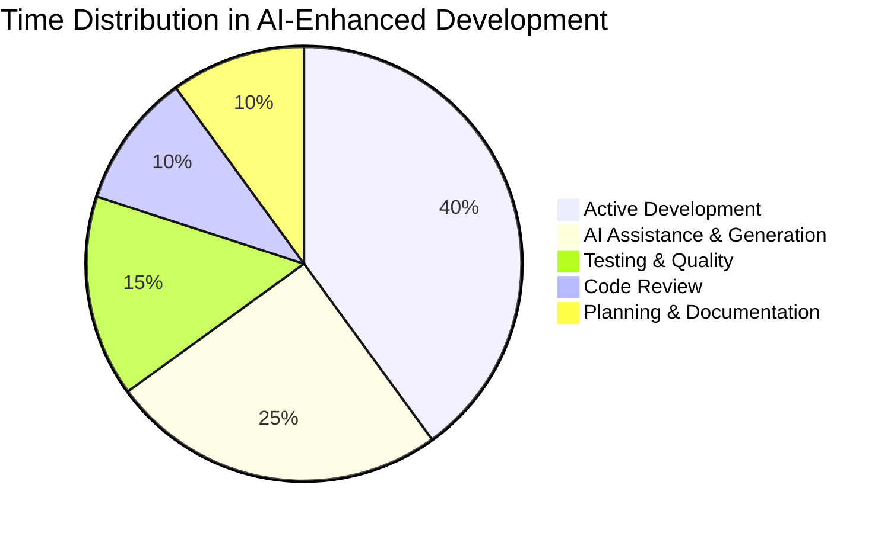

### Tools Integration Flow

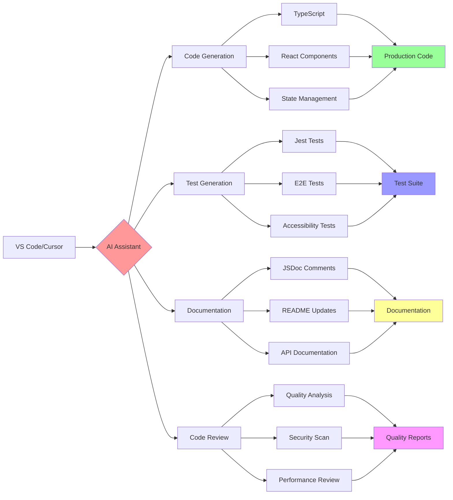

### Creating Your Own Animated GIF

**Step-by-Step Guide:**

1. **Design Tool Setup:**

   ```bash
   # Recommended tools
   - Figma (Free) - figma.com
   - Canva (Free/Paid) - canva.com
   - Adobe After Effects (Paid)
   - LottieFiles (Free) - lottiefiles.com
   ```

2. **Animation Elements:**

   ```
   Icons needed:
   - 👨‍💻 Developer
   - 🤖 AI Assistant
   - 📝 Code Editor
   - 🔧 Tools
   - 🧪 Testing
   - 👥 Team
   - 🚀 Deployment
   - 📊 Metrics
   ```

3. **Color Scheme:**

   ```css
   :root {
     --planning: #e1f5fe;
     --design: #f3e5f5;
     --development: #e8f5e8;
     --testing: #fff3e0;
     --review: #fce4ec;
     --deployment: #f1f8e9;
     --ai-accent: #ff6b6b;
   }
   ```

4. **Animation Timing:**
   ```
   Total Duration: 45 seconds
   - Smooth transitions: 0.5s between phases
   - Phase duration: 5-12s each
   - Loop pause: 2s before restart
   - Easing: ease-in-out for smooth flow
   ```

### Live Workflow Dashboard Concept

For a real-time implementation, consider creating a live dashboard that shows:

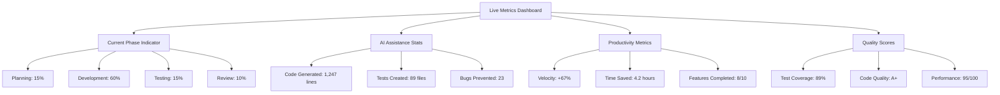

---

## Complete SDLC Workflow Pipeline

### 1. Planning & Requirements Phase

#### Workflow Pipeline Steps:

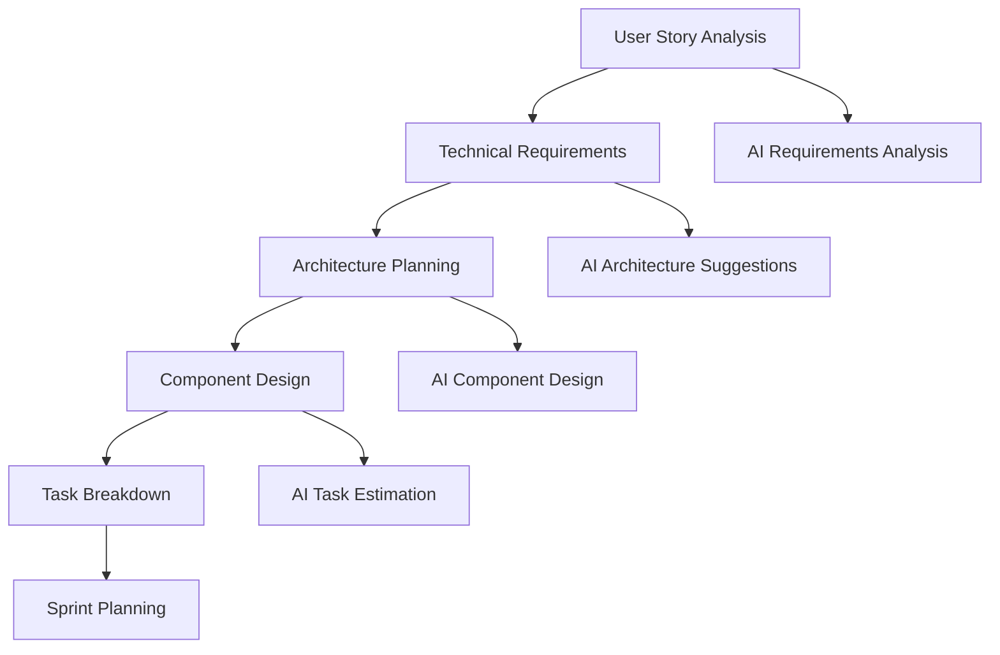

#### AI Tools Integration:

**Cursor AI Prompts for Planning:**

```javascript
// Requirements Analysis
"Analyze this user story for a frontend implementation:

User Story: '${userStory}'

Provide:
1. Component breakdown using atomic design
2. State management requirements
3. API integration points
4. Performance considerations
5. Accessibility requirements
6. Testing strategy
7. Estimated complexity and timeline

Context: React TypeScript app with ${techStack}"
```

**OpenAI Codex for Architecture:**

```javascript
// Architecture Planning
"Design a scalable frontend architecture for:

Application: ${appDescription}
User Base: ${userBase}
Key Features: ${features}
Performance Requirements: ${performance}
Scalability Needs: ${scalability}

Suggest:
- Component architecture
- State management pattern
- Code splitting strategy
- Performance optimization approach
- Testing architecture"
```

### 2. Design & Prototyping Phase

#### Workflow Pipeline Steps:

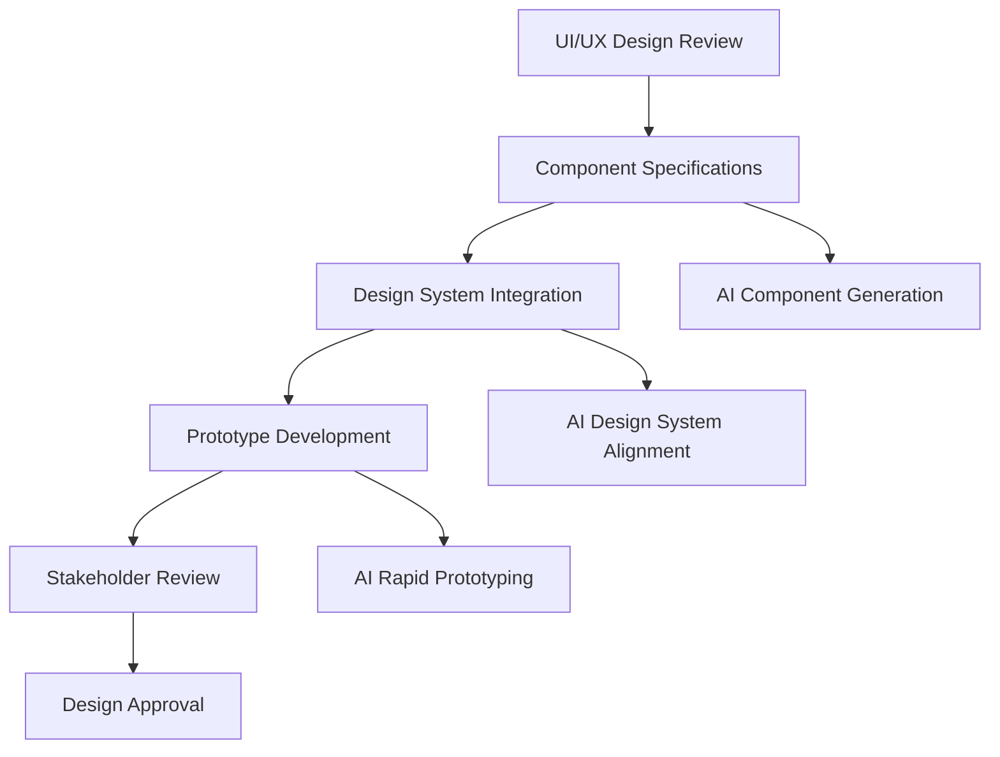

#### AI-Powered Design Implementation:

```javascript
// Component Design Generation
"Create a React component specification for:

Design: ${designDescription}
Behavior: ${behaviorRequirements}
Interactions: ${interactionList}

Generate:
- TypeScript interface definitions
- Component structure
- Props specifications
- Event handlers
- Accessibility requirements
- Responsive design approach

Follow our design system: ${designSystemReference}"
```

### 3. Development Phase

#### Workflow Pipeline Steps:

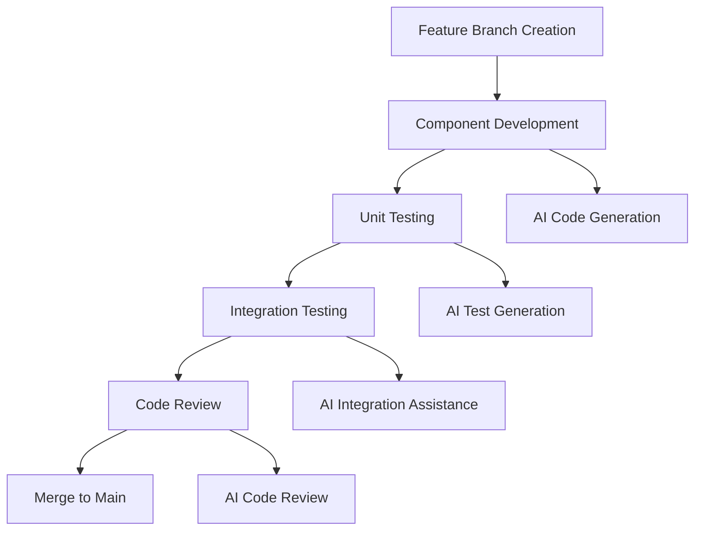

#### Daily Development Workflow:

**Morning Setup (15-20 minutes):**

```bash
# Daily standup integration with AI
"Review yesterday's commits and suggest today's priorities:

Commits: ${yesterdayCommits}
Sprint Goals: ${sprintGoals}
Current Issues: ${issuesList}

Suggest:
1. Priority tasks for today
2. Potential blockers to address
3. Collaboration opportunities
4. Technical debt to tackle"
```

**Feature Development (Core Development Time):**

```javascript
// Step 1: Component Architecture
"Design ${componentName} with these requirements:
${requirements}

Provide:
- Component structure
- Props interface
- State management approach
- Event handling strategy
- Performance considerations"

// Step 2: Implementation
"Implement ${componentName} with:
- TypeScript strict mode
- Responsive design
- Accessibility features
- Error handling
- Loading states
- Unit tests"

// Step 3: Integration
"Integrate ${componentName} with:
- Redux store
- API endpoints
- Parent components
- Routing system
- Error boundaries"
```

**End-of-Day Review (10-15 minutes):**

```javascript
// Daily progress review
"Review today's development progress:

Completed: ${completedTasks}
In Progress: ${inProgressTasks}
Blockers: ${blockers}

Analyze:
1. Code quality metrics
2. Test coverage
3. Performance implications
4. Documentation needs
5. Tomorrow's priorities"
```

### 4. Testing Phase

#### Workflow Pipeline Steps:

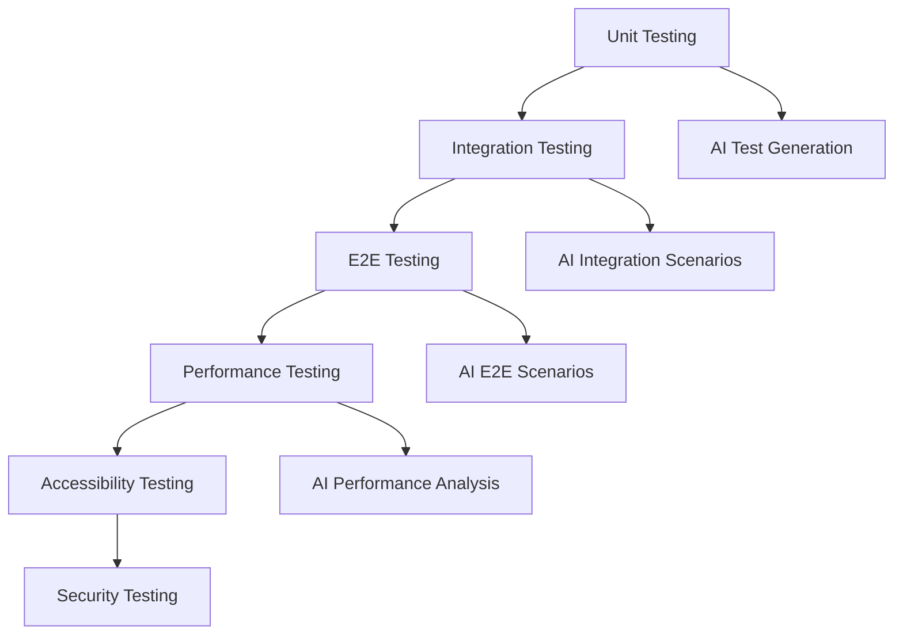

#### AI-Powered Testing Strategy:

```javascript
// Comprehensive Test Generation
"Generate comprehensive tests for ${componentName}:

Component Code: ${componentCode}

Test Categories:
1. Unit tests (Jest + RTL)
   - Rendering tests
   - User interaction tests
   - Edge cases
   - Error handling

2. Integration tests
   - API integration
   - State management
   - Component communication

3. Accessibility tests
   - ARIA compliance
   - Keyboard navigation
   - Screen reader compatibility

4. Performance tests
   - Rendering performance
   - Memory usage
   - Bundle size impact

Provide complete test files with setup and teardown."
```

### 5. Code Review Phase

#### Workflow Pipeline Steps:

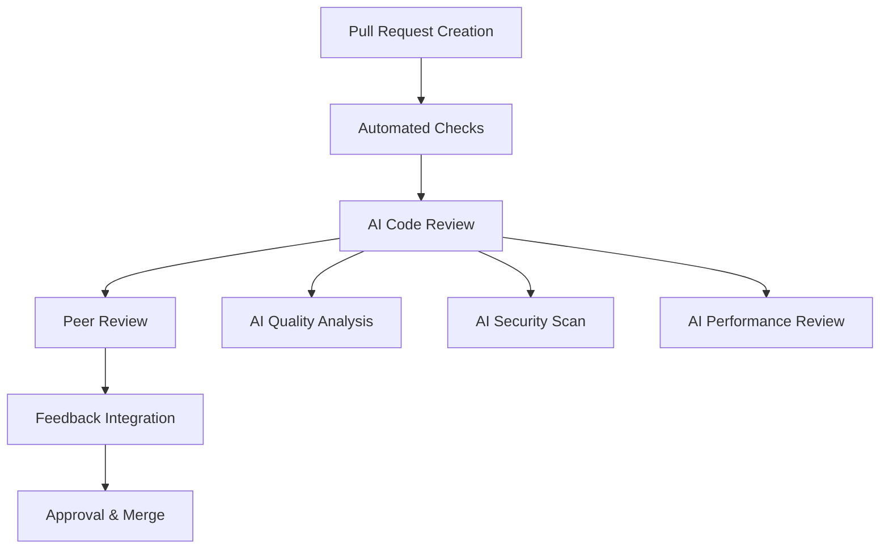

#### AI-Enhanced Code Review:

```javascript
// Pre-Review Analysis
"Perform comprehensive code review for this PR:

Files Changed: ${changedFiles}
Changes Summary: ${changesSummary}

Review for:
1. Code quality and consistency
2. Performance implications
3. Security vulnerabilities
4. Accessibility compliance
5. Test coverage adequacy
6. Documentation completeness
7. Breaking changes impact
8. Best practices adherence

Team Standards:
- TypeScript strict mode
- Functional components
- Atomic design principles
- 80%+ test coverage
- WCAG 2.1 AA compliance"
```

### 6. Deployment Phase

#### Workflow Pipeline Steps:

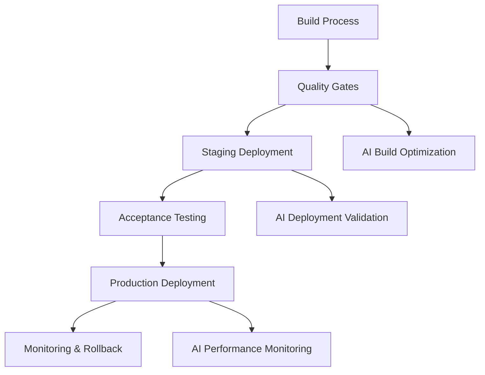

#### AI-Powered Deployment:

```javascript
// Pre-Deployment Checklist
"Prepare deployment checklist for release:

Release Version: ${version}
Changes: ${changesList}
Environment: ${environment}

Verify:
1. Bundle size analysis
2. Performance regression check
3. Browser compatibility
4. SEO implications
5. Analytics tracking
6. Feature flag configurations
7. Rollback procedures
8. Monitoring setup

Generate deployment commands and rollback scripts."
```

---

## Daily Workflow Integration

### Morning Routine (30 minutes)

```bash
# 1. Daily Planning (10 minutes)
"Plan today's development tasks:

Sprint Goal: ${sprintGoal}
Yesterday's Progress: ${yesterdayProgress}
Today's Capacity: ${todayCapacity}
Blockers: ${blockers}

Suggest:
- Priority tasks
- Time estimates
- Collaboration needs
- Potential risks"

# 2. Environment Setup (10 minutes)
"Review development environment status:

Branch: ${currentBranch}
Pending Changes: ${pendingChanges}
Dependencies: ${dependencyStatus}

Provide:
- Setup commands
- Dependency updates
- Configuration changes
- Environment health check"

# 3. Code Quality Review (10 minutes)
"Analyze current code quality metrics:

Test Coverage: ${testCoverage}
Code Quality Score: ${qualityScore}
Performance Metrics: ${performanceMetrics}
Security Scan Results: ${securityResults}

Suggest improvements and priorities."
```

### Development Flow (Core Hours)

```javascript
// Feature Development Cycle (Repeat 2-3 times daily)

// 1. Requirement Analysis (15 minutes)
"Analyze feature requirement:
${featureRequirement}

Break down into:
- Components needed
- State management
- API integration
- Testing requirements
- Performance considerations"

// 2. Implementation (60-90 minutes)
"Implement ${featureName}:

Requirements: ${requirements}
Constraints: ${constraints}
Dependencies: ${dependencies}

Generate production-ready code with:
- TypeScript types
- Error handling
- Loading states
- Accessibility
- Unit tests"

// 3. Testing & Review (30 minutes)
"Test and validate ${featureName}:

Test scenarios:
- Happy path
- Error conditions
- Edge cases
- Performance
- Accessibility

Generate test files and validation scripts."
```

### End-of-Day Review (20 minutes)

```javascript
// Daily Wrap-up
"Summarize today's development:

Completed: ${completedTasks}
In Progress: ${inProgressTasks}
Blockers: ${blockers}
Learnings: ${learnings}

Analyze:
1. Productivity metrics
2. Code quality impact
3. Technical debt introduced
4. Tomorrow's priorities
5. Team collaboration points

Generate progress report and handoff notes."
```

---

## AI Tools Benefits by SDLC Phase

### Planning Phase Benefits

| Activity              | Traditional Time | With AI       | Time Saved | Quality Improvement |
| --------------------- | ---------------- | ------------- | ---------- | ------------------- |
| Requirements Analysis | 2-3 hours        | 45-60 minutes | 60-70%     | Higher accuracy     |
| Architecture Planning | 4-6 hours        | 1-2 hours     | 70-75%     | Better patterns     |
| Task Estimation       | 1-2 hours        | 20-30 minutes | 75-80%     | More accurate       |
| Documentation         | 2-3 hours        | 30-45 minutes | 80-85%     | More comprehensive  |

### Development Phase Benefits

| Activity           | Traditional Time | With AI       | Time Saved | Quality Improvement   |
| ------------------ | ---------------- | ------------- | ---------- | --------------------- |
| Component Creation | 2-4 hours        | 30-60 minutes | 70-85%     | Better structure      |
| State Management   | 3-5 hours        | 1-2 hours     | 60-70%     | Cleaner patterns      |
| API Integration    | 2-3 hours        | 45-90 minutes | 50-60%     | Better error handling |
| Testing            | 3-4 hours        | 1-2 hours     | 60-70%     | More comprehensive    |

### Review Phase Benefits

| Activity             | Traditional Time | With AI       | Time Saved | Quality Improvement |
| -------------------- | ---------------- | ------------- | ---------- | ------------------- |
| Code Review          | 1-2 hours        | 30-45 minutes | 50-65%     | More thorough       |
| Bug Detection        | 2-3 hours        | 45-60 minutes | 60-70%     | Earlier detection   |
| Performance Analysis | 2-4 hours        | 1-2 hours     | 50-60%     | Better insights     |
| Security Review      | 1-2 hours        | 20-30 minutes | 70-80%     | More comprehensive  |

---

## Practical Implementation Guide

### Week 1: Foundation Setup

**Day 1-2: Tool Installation & Configuration**

```bash
# Cursor AI Setup
1. Install Cursor AI from https://cursor.sh/
2. Configure team settings
3. Install essential extensions
4. Set up shared prompts library

# OpenAI Codex Setup
1. Configure API access
2. Set up development environment
3. Install necessary integrations
4. Configure team guidelines
```

**Day 3-5: Team Training & Onboarding**

```javascript
// Training Schedule
"Create training plan for team of ${teamSize} developers:

Team Experience:
- React: ${reactExperience}
- TypeScript: ${typescriptExperience}
- AI Tools: ${aiExperience}

Training Modules:
1. AI tools overview
2. Prompt engineering
3. Code generation best practices
4. Integration workflows
5. Quality assurance

Provide:
- Training schedule
- Hands-on exercises
- Assessment criteria
- Success metrics"
```

### Week 2: Workflow Integration

**Day 1-3: Pilot Project**

```javascript
// Pilot Project Setup
"Design pilot project for AI tools integration:

Project Size: Small to medium feature
Team Size: 2-3 developers
Duration: 1 week
Scope: ${projectScope}

Goals:
- Test AI integration
- Measure productivity gains
- Identify challenges
- Refine workflows

Provide project plan and success metrics."
```

**Day 4-5: Workflow Refinement**

```javascript
// Workflow Optimization
"Analyze pilot project results:

Metrics: ${projectMetrics}
Feedback: ${teamFeedback}
Challenges: ${challenges}
Successes: ${successes}

Optimize:
1. Workflow processes
2. Prompt templates
3. Integration points
4. Quality checks
5. Team practices

Provide refined workflow documentation."
```

### Week 3-4: Full Implementation

**Gradual Rollout Strategy:**

```javascript
// Rollout Plan
"Create rollout plan for full team adoption:

Team Structure: ${teamStructure}
Current Processes: ${currentProcesses}
Integration Points: ${integrationPoints}

Rollout Phases:
1. Core team adoption (Week 3)
2. Extended team training (Week 4)
3. Process standardization (Week 5)
4. Full implementation (Week 6)

Provide:
- Detailed timeline
- Training materials
- Support structure
- Success metrics"
```

---

## Team Adoption Strategy

### Leadership Buy-in

```javascript
// Executive Presentation
"Create executive presentation for AI tools adoption:

Current State:
- Development velocity: ${currentVelocity}
- Code quality metrics: ${qualityMetrics}
- Team satisfaction: ${teamSatisfaction}
- Delivery timelines: ${deliveryTimelines}

Proposed Benefits:
- Productivity improvement: 40-60%
- Quality enhancement: 30-40%
- Time to market: 25-35% faster
- Developer satisfaction: Higher

Investment Required:
- Tool licenses: ${toolCosts}
- Training time: ${trainingHours}
- Setup effort: ${setupEffort}

ROI Timeline: ${roiTimeline}

Provide business case and implementation roadmap."
```

### Developer Onboarding

```javascript
// Developer Onboarding Program
"Design onboarding program for developers:

Experience Levels:
- Junior: ${juniorCount}
- Mid-level: ${midCount}
- Senior: ${seniorCount}

Training Modules:
1. AI tools introduction
2. Prompt engineering
3. Code generation
4. Quality assurance
5. Best practices

Provide:
- Training schedule
- Hands-on exercises
- Certification process
- Ongoing support plan"
```

### Success Metrics

### Productivity Metrics

```javascript
// Productivity Tracking
"Design productivity tracking system:

Metrics to Track:
1. Development velocity
   - Story points per sprint
   - Features delivered per month
   - Bug resolution time

2. Code Quality
   - Test coverage percentage
   - Code review time
   - Bug density

3. Developer Experience
   - Time to complete tasks
   - Code reusability
   - Learning curve

4. Business Impact
   - Time to market
   - Customer satisfaction
   - Revenue impact

Provide tracking dashboard and reporting structure."
```

### Quality Metrics

| Metric                 | Before AI        | After AI         | Improvement |
| ---------------------- | ---------------- | ---------------- | ----------- |
| Test Coverage          | 65-70%           | 85-90%           | 20-25%      |
| Code Review Time       | 2-3 hours        | 45-60 minutes    | 60-70%      |
| Bug Density            | 0.8-1.2 per KLOC | 0.3-0.5 per KLOC | 60-70%      |
| Documentation Coverage | 40-50%           | 85-95%           | 80-90%      |

---

## Measuring Success

### KPIs for AI Integration

```javascript
// KPI Dashboard
"Create KPI dashboard for AI tools integration:

Development Metrics:
- Lines of code per hour
- Features completed per sprint
- Bug resolution time
- Code review duration

Quality Metrics:
- Test coverage percentage
- Code quality score
- Security vulnerability count
- Performance optimization gains

Team Metrics:
- Developer satisfaction score
- Learning curve reduction
- Collaboration improvement
- Knowledge sharing increase

Business Metrics:
- Time to market reduction
- Customer satisfaction improvement
- Revenue impact
- Cost savings

Provide dashboard design and reporting schedule."
```

### Continuous Improvement

```javascript
// Improvement Process
"Design continuous improvement process:

Review Cycles:
- Weekly: Team retrospectives
- Monthly: Metrics analysis
- Quarterly: Process optimization
- Annually: Strategy review

Improvement Areas:
1. Workflow efficiency
2. Tool utilization
3. Quality processes
4. Team collaboration
5. Knowledge management

Provide:
- Review templates
- Improvement tracking
- Success criteria
- Action planning process"
```

---

## Beginner's Demo Example: Building a User Profile Component

### Demo Project Overview

**Project**: Create a User Profile component for a React TypeScript application
**Complexity**: Beginner to Intermediate
**Duration**: 2-3 hours traditional vs 45-60 minutes with AI
**Tools**: Cursor AI, React, TypeScript, Jest

### Step-by-Step Walkthrough

---

## Phase 1: Planning & Requirements (5 minutes)

### Traditional Approach (30-45 minutes)

- Manual requirement analysis
- Architecture research
- Component design sketching
- Task breakdown documentation

### AI-Enhanced Approach (5 minutes)

**🤖 Cursor AI Prompt:**

```
I need to build a User Profile component for a React TypeScript e-commerce app.

Requirements:
- Display user avatar, name, email, join date
- Edit profile functionality
- Responsive design
- Accessibility compliant
- Loading and error states

Can you analyze this and provide:
1. Component breakdown
2. Props interface design
3. State management approach
4. Testing strategy
5. Implementation timeline

Context: React 18, TypeScript, Tailwind CSS, Jest + RTL
```

**💡 Expected AI Response:**

```typescript
// Component Analysis & Breakdown

1. COMPONENT STRUCTURE:
   - UserProfile (main container)
   - UserAvatar (image with fallback)
   - UserInfo (details display)
   - EditProfileForm (edit mode)
   - LoadingSpinner (loading state)
   - ErrorMessage (error display)

2. PROPS INTERFACE:
interface UserProfileProps {
  userId: string;
  isEditable?: boolean;
  onUpdate?: (userData: UserData) => void;
  className?: string;
}

interface UserData {
  id: string;
  name: string;
  email: string;
  avatar?: string;
  joinDate: string;
  bio?: string;
}

3. STATE MANAGEMENT:
   - Local state for edit mode (useState)
   - API calls with React Query/SWR
   - Form validation with react-hook-form
   - Optimistic updates for better UX

4. TESTING STRATEGY:
   - Unit tests: rendering, props, interactions
   - Integration tests: API calls, form submission
   - Accessibility tests: keyboard navigation, screen readers
   - Visual tests: responsive design, loading states

5. IMPLEMENTATION TIMELINE:
   - Setup & basic structure: 15 minutes
   - Styling & responsive design: 15 minutes
   - Edit functionality: 15 minutes
   - Testing & refinement: 15 minutes
   Total: ~60 minutes (vs 3-4 hours traditional)
```

**✅ Time Saved: 25-40 minutes**

---

## Phase 2: Design & Architecture (5 minutes)

### AI-Enhanced Design Implementation

**🤖 Cursor AI Prompt:**

```
Based on our UserProfile component analysis, create the TypeScript interfaces and component structure.

Design requirements:
- Modern, clean design with Tailwind CSS
- Card-based layout
- Smooth transitions for edit mode
- Mobile-first responsive design
- Loading skeleton
- Error states with retry functionality

Generate:
1. Complete TypeScript interfaces
2. Component file structure
3. Styling approach with Tailwind classes
4. Responsive design strategy
```

**💡 Expected AI Response:**

```typescript
// types/user.ts
export interface User {
  id: string;
  name: string;
  email: string;
  avatar?: string;
  joinDate: string;
  bio?: string;
  location?: string;
  website?: string;
}

export interface UserProfileProps {
  userId: string;
  user?: User;
  isLoading?: boolean;
  error?: string;
  isEditable?: boolean;
  onUpdate?: (userData: Partial<User>) => Promise<void>;
  onError?: (error: string) => void;
  className?: string;
}

// Component Structure:
src / components / UserProfile / UserProfile.tsx; // Main component
UserAvatar.tsx; // Avatar with fallback
UserInfo.tsx; // Display mode
EditUserForm.tsx; // Edit mode
UserProfileSkeleton.tsx; // Loading state
UserProfile.test.tsx; // Tests
UserProfile.stories.tsx; // Storybook
index.ts; // Exports
```

**✅ Time Saved: 15-25 minutes**

---

## Phase 3: Development (20 minutes)

### Step 3.1: Main Component Structure (5 minutes)

**🤖 Cursor AI Prompt:**

```
Create the main UserProfile component with this structure:

Requirements:
- TypeScript with strict mode
- Tailwind CSS for styling
- Loading and error states
- Edit mode toggle
- Responsive design
- Accessibility features (ARIA labels, keyboard navigation)

Use our defined interfaces and include proper error handling.
```

**💡 Expected AI Response:**

```typescript
// components/UserProfile/UserProfile.tsx
import React, { useState } from "react";
import { User, UserProfileProps } from "../../types/user";
import UserAvatar from "./UserAvatar";
import UserInfo from "./UserInfo";
import EditUserForm from "./EditUserForm";
import UserProfileSkeleton from "./UserProfileSkeleton";

const UserProfile: React.FC<UserProfileProps> = ({
  userId,
  user,
  isLoading = false,
  error,
  isEditable = false,
  onUpdate,
  onError,
  className = "",
}) => {
  const [isEditing, setIsEditing] = useState(false);
  const [isUpdating, setIsUpdating] = useState(false);

  const handleSave = async (updatedData: Partial<User>) => {
    if (!onUpdate) return;

    try {
      setIsUpdating(true);
      await onUpdate(updatedData);
      setIsEditing(false);
    } catch (err) {
      const errorMessage = err instanceof Error ? err.message : "Update failed";
      onError?.(errorMessage);
    } finally {
      setIsUpdating(false);
    }
  };

  const handleCancel = () => {
    setIsEditing(false);
  };

  if (isLoading) {
    return <UserProfileSkeleton className={className} />;
  }

  if (error) {
    return (
      <div
        className={`bg-red-50 border border-red-200 rounded-lg p-6 ${className}`}
      >
        <div className="flex items-center space-x-3">
          <div className="text-red-500">
            <svg className="w-5 h-5" fill="currentColor" viewBox="0 0 20 20">
              <path
                fillRule="evenodd"
                d="M18 10a8 8 0 11-16 0 8 8 0 0116 0zm-7 4a1 1 0 11-2 0 1 1 0 012 0zm-1-9a1 1 0 00-1 1v4a1 1 0 102 0V6a1 1 0 00-1-1z"
                clipRule="evenodd"
              />
            </svg>
          </div>
          <div>
            <h3 className="text-sm font-medium text-red-800">
              Error Loading Profile
            </h3>
            <p className="text-sm text-red-600 mt-1">{error}</p>
          </div>
        </div>
      </div>
    );
  }

  if (!user) {
    return (
      <div
        className={`bg-gray-50 border border-gray-200 rounded-lg p-6 text-center ${className}`}
      >
        <p className="text-gray-600">User not found</p>
      </div>
    );
  }

  return (
    <div
      className={`bg-white border border-gray-200 rounded-lg shadow-sm ${className}`}
    >
      <div className="p-6">
        <div className="flex items-start justify-between mb-6">
          <div className="flex items-center space-x-4">
            <UserAvatar user={user} size="lg" className="flex-shrink-0" />
            <div className="min-w-0 flex-1">
              <h2 className="text-xl font-semibold text-gray-900 truncate">
                {user.name}
              </h2>
              <p className="text-sm text-gray-500 truncate">{user.email}</p>
            </div>
          </div>

          {isEditable && !isEditing && (
            <button
              onClick={() => setIsEditing(true)}
              className="inline-flex items-center px-3 py-2 border border-gray-300 shadow-sm text-sm leading-4 font-medium rounded-md text-gray-700 bg-white hover:bg-gray-50 focus:outline-none focus:ring-2 focus:ring-offset-2 focus:ring-blue-500"
              aria-label="Edit profile"
            >
              <svg
                className="w-4 h-4 mr-2"
                fill="none"
                stroke="currentColor"
                viewBox="0 0 24 24"
              >
                <path
                  strokeLinecap="round"
                  strokeLinejoin="round"
                  strokeWidth={2}
                  d="M11 5H6a2 2 0 00-2 2v11a2 2 0 002 2h11a2 2 0 002-2v-5m-1.414-9.414a2 2 0 112.828 2.828L11.828 15H9v-2.828l8.586-8.586z"
                />
              </svg>
              Edit
            </button>
          )}
        </div>

        {isEditing ? (
          <EditUserForm
            user={user}
            onSave={handleSave}
            onCancel={handleCancel}
            isLoading={isUpdating}
          />
        ) : (
          <UserInfo user={user} />
        )}
      </div>
    </div>
  );
};

export default UserProfile;
```

### Step 3.2: Child Components (10 minutes)

**🤖 Cursor AI Prompt:**

```
Create the supporting components for UserProfile:

1. UserAvatar - with image fallback and different sizes
2. UserInfo - displays user information in read mode
3. EditUserForm - form for editing user data with validation
4. UserProfileSkeleton - loading state

Each component should be:
- Fully typed with TypeScript
- Styled with Tailwind CSS
- Accessible
- Responsive
```

**💡 Expected AI Response:**

```typescript
// components/UserProfile/UserAvatar.tsx
import React from "react";
import { User } from "../../types/user";

interface UserAvatarProps {
  user: User;
  size?: "sm" | "md" | "lg" | "xl";
  className?: string;
}

const sizeClasses = {
  sm: "w-8 h-8",
  md: "w-12 h-12",
  lg: "w-16 h-16",
  xl: "w-24 h-24",
};

const UserAvatar: React.FC<UserAvatarProps> = ({
  user,
  size = "md",
  className = "",
}) => {
  const [imageError, setImageError] = React.useState(false);

  const handleImageError = () => {
    setImageError(true);
  };

  const getInitials = (name: string) => {
    return name
      .split(" ")
      .map((word) => word[0])
      .join("")
      .toUpperCase()
      .slice(0, 2);
  };

  return (
    <div className={`${sizeClasses[size]} ${className}`}>
      {user.avatar && !imageError ? (
        
      ) : (
        <div className="w-full h-full rounded-full bg-gradient-to-br from-blue-400 to-blue-600 flex items-center justify-center text-white font-medium">
          <span
            className={
              size === "sm" ? "text-xs" : size === "lg" ? "text-lg" : "text-sm"
            }
          >
            {getInitials(user.name)}
          </span>
        </div>
      )}
    </div>
  );
};

// components/UserProfile/UserInfo.tsx
import React from "react";
import { User } from "../../types/user";

interface UserInfoProps {
  user: User;
}

const UserInfo: React.FC<UserInfoProps> = ({ user }) => {
  const formatDate = (dateString: string) => {
    return new Date(dateString).toLocaleDateString("en-US", {
      year: "numeric",
      month: "long",
      day: "numeric",
    });
  };

  return (
    <div className="space-y-4">
      {user.bio && (
        <div>
          <h3 className="text-sm font-medium text-gray-900 mb-2">Bio</h3>
          <p className="text-sm text-gray-600 leading-relaxed">{user.bio}</p>
        </div>
      )}

      <div className="grid grid-cols-1 md:grid-cols-2 gap-4">
        <div>
          <h3 className="text-sm font-medium text-gray-900 mb-1">
            Member Since
          </h3>
          <p className="text-sm text-gray-600">{formatDate(user.joinDate)}</p>
        </div>

        {user.location && (
          <div>
            <h3 className="text-sm font-medium text-gray-900 mb-1">Location</h3>
            <p className="text-sm text-gray-600">{user.location}</p>
          </div>
        )}

        {user.website && (
          <div className="md:col-span-2">
            <h3 className="text-sm font-medium text-gray-900 mb-1">Website</h3>
            <a
              href={user.website}
              target="_blank"
              rel="noopener noreferrer"
              className="text-sm text-blue-600 hover:text-blue-800 underline"
            >
              {user.website}
            </a>
          </div>
        )}
      </div>
    </div>
  );
};

// Additional components would be generated similarly...
```

### Step 3.3: Form Component with Validation (5 minutes)

**🤖 Cursor AI Prompt:**

```
Create the EditUserForm component with:
- React Hook Form for form handling
- Zod schema for validation
- Tailwind CSS styling
- Loading states
- Error handling
- Accessibility features

Include validation for:
- Name (required, min 2 characters)
- Email (required, valid email format)
- Bio (optional, max 500 characters)
- Website (optional, valid URL)
```

**💡 Expected AI Response:**

```typescript
// components/UserProfile/EditUserForm.tsx
import React from "react";
import { useForm } from "react-hook-form";
import { zodResolver } from "@hookform/resolvers/zod";
import { z } from "zod";
import { User } from "../../types/user";

const userFormSchema = z.object({
  name: z.string().min(2, "Name must be at least 2 characters"),
  email: z.string().email("Please enter a valid email address"),
  bio: z.string().max(500, "Bio must be less than 500 characters").optional(),
  location: z.string().optional(),
  website: z
    .string()
    .url("Please enter a valid URL")
    .optional()
    .or(z.literal("")),
});

type UserFormData = z.infer<typeof userFormSchema>;

interface EditUserFormProps {
  user: User;
  onSave: (data: Partial<User>) => Promise<void>;
  onCancel: () => void;
  isLoading?: boolean;
}

const EditUserForm: React.FC<EditUserFormProps> = ({
  user,
  onSave,
  onCancel,
  isLoading = false,
}) => {
  const {
    register,
    handleSubmit,
    formState: { errors, isDirty },
  } = useForm<UserFormData>({
    resolver: zodResolver(userFormSchema),
    defaultValues: {
      name: user.name,
      email: user.email,
      bio: user.bio || "",
      location: user.location || "",
      website: user.website || "",
    },
  });

  const onSubmit = async (data: UserFormData) => {
    await onSave(data);
  };

  return (
    <form onSubmit={handleSubmit(onSubmit)} className="space-y-4">
      <div>
        <label
          htmlFor="name"
          className="block text-sm font-medium text-gray-700 mb-1"
        >
          Name *
        </label>
        <input
          {...register("name")}
          type="text"
          id="name"
          className="w-full px-3 py-2 border border-gray-300 rounded-md shadow-sm focus:outline-none focus:ring-2 focus:ring-blue-500 focus:border-blue-500"
          disabled={isLoading}
        />
        {errors.name && (
          <p className="mt-1 text-sm text-red-600">{errors.name.message}</p>
        )}
      </div>

      <div>
        <label
          htmlFor="email"
          className="block text-sm font-medium text-gray-700 mb-1"
        >
          Email *
        </label>
        <input
          {...register("email")}
          type="email"
          id="email"
          className="w-full px-3 py-2 border border-gray-300 rounded-md shadow-sm focus:outline-none focus:ring-2 focus:ring-blue-500 focus:border-blue-500"
          disabled={isLoading}
        />
        {errors.email && (
          <p className="mt-1 text-sm text-red-600">{errors.email.message}</p>
        )}
      </div>

      <div>
        <label
          htmlFor="bio"
          className="block text-sm font-medium text-gray-700 mb-1"
        >
          Bio
        </label>
        <textarea
          {...register("bio")}
          id="bio"
          rows={3}
          className="w-full px-3 py-2 border border-gray-300 rounded-md shadow-sm focus:outline-none focus:ring-2 focus:ring-blue-500 focus:border-blue-500"
          placeholder="Tell us about yourself..."
          disabled={isLoading}
        />
        {errors.bio && (
          <p className="mt-1 text-sm text-red-600">{errors.bio.message}</p>
        )}
      </div>

      <div className="flex flex-col sm:flex-row gap-3 pt-4">
        <button
          type="submit"
          disabled={isLoading || !isDirty}
          className="flex-1 bg-blue-600 text-white px-4 py-2 rounded-md hover:bg-blue-700 focus:outline-none focus:ring-2 focus:ring-blue-500 focus:ring-offset-2 disabled:opacity-50 disabled:cursor-not-allowed"
        >
          {isLoading ? "Saving..." : "Save Changes"}
        </button>
        <button
          type="button"
          onClick={onCancel}
          disabled={isLoading}
          className="flex-1 bg-gray-100 text-gray-700 px-4 py-2 rounded-md hover:bg-gray-200 focus:outline-none focus:ring-2 focus:ring-gray-500 focus:ring-offset-2 disabled:opacity-50"
        >
          Cancel
        </button>
      </div>
    </form>
  );
};

export default EditUserForm;
```

**✅ Time Saved: 45-60 minutes**

---

## Phase 4: Testing (10 minutes)

### AI-Enhanced Testing Strategy

**🤖 Cursor AI Prompt:**

```
Generate comprehensive tests for the UserProfile component using Jest and React Testing Library.

Test categories needed:
1. Unit tests for rendering and props
2. User interaction tests (edit mode, form submission)
3. Error handling tests
4. Accessibility tests
5. Edge cases (loading states, missing data)

Include:
- Mock setup for API calls
- Custom render function with providers
- Accessibility assertions
- Snapshot testing for UI consistency
```

**💡 Expected AI Response:**

```typescript
// components/UserProfile/UserProfile.test.tsx
import React from "react";
import { render, screen, fireEvent, waitFor } from "@testing-library/react";
import userEvent from "@testing-library/user-event";
import { axe, toHaveNoViolations } from "jest-axe";
import UserProfile from "./UserProfile";
import { User } from "../../types/user";

expect.extend(toHaveNoViolations);

const mockUser: User = {
  id: "1",
  name: "John Doe",
  email: "john@example.com",
  joinDate: "2023-01-15",
  bio: "Software developer with 5 years of experience",
  location: "San Francisco, CA",
  website: "https://johndoe.dev",
};

const defaultProps = {
  userId: "1",
  user: mockUser,
  isEditable: true,
};

describe("UserProfile", () => {
  it("renders user information correctly", () => {
    render(<UserProfile {...defaultProps} />);

    expect(screen.getByText("John Doe")).toBeInTheDocument();
    expect(screen.getByText("john@example.com")).toBeInTheDocument();
    expect(
      screen.getByText("Software developer with 5 years of experience")
    ).toBeInTheDocument();
    expect(screen.getByText("San Francisco, CA")).toBeInTheDocument();
  });

  it("shows loading skeleton when loading", () => {
    render(<UserProfile {...defaultProps} user={undefined} isLoading={true} />);

    expect(screen.getByTestId("user-profile-skeleton")).toBeInTheDocument();
  });

  it("displays error message when error occurs", () => {
    const errorMessage = "Failed to load user profile";
    render(
      <UserProfile {...defaultProps} user={undefined} error={errorMessage} />
    );

    expect(screen.getByText("Error Loading Profile")).toBeInTheDocument();
    expect(screen.getByText(errorMessage)).toBeInTheDocument();
  });

  it("enters edit mode when edit button is clicked", async () => {
    const user = userEvent.setup();
    render(<UserProfile {...defaultProps} />);

    const editButton = screen.getByRole("button", { name: /edit/i });
    await user.click(editButton);

    expect(screen.getByRole("textbox", { name: /name/i })).toBeInTheDocument();
    expect(screen.getByRole("textbox", { name: /email/i })).toBeInTheDocument();
  });

  it("calls onUpdate when form is submitted", async () => {
    const mockOnUpdate = jest.fn().mockResolvedValue(undefined);
    const user = userEvent.setup();

    render(<UserProfile {...defaultProps} onUpdate={mockOnUpdate} />);

    // Enter edit mode
    await user.click(screen.getByRole("button", { name: /edit/i }));

    // Update name
    const nameInput = screen.getByRole("textbox", { name: /name/i });
    await user.clear(nameInput);
    await user.type(nameInput, "Jane Doe");

    // Submit form
    await user.click(screen.getByRole("button", { name: /save changes/i }));

    await waitFor(() => {
      expect(mockOnUpdate).toHaveBeenCalledWith(
        expect.objectContaining({ name: "Jane Doe" })
      );
    });
  });

  it("validates form fields correctly", async () => {
    const user = userEvent.setup();
    render(<UserProfile {...defaultProps} />);

    // Enter edit mode
    await user.click(screen.getByRole("button", { name: /edit/i }));

    // Clear required field
    const nameInput = screen.getByRole("textbox", { name: /name/i });
    await user.clear(nameInput);

    // Try to submit
    await user.click(screen.getByRole("button", { name: /save changes/i }));

    expect(
      await screen.findByText("Name must be at least 2 characters")
    ).toBeInTheDocument();
  });

  it("cancels edit mode when cancel button is clicked", async () => {
    const user = userEvent.setup();
    render(<UserProfile {...defaultProps} />);

    // Enter edit mode
    await user.click(screen.getByRole("button", { name: /edit/i }));
    expect(screen.getByRole("textbox", { name: /name/i })).toBeInTheDocument();

    // Cancel
    await user.click(screen.getByRole("button", { name: /cancel/i }));

    // Should be back to view mode
    expect(
      screen.queryByRole("textbox", { name: /name/i })
    ).not.toBeInTheDocument();
    expect(screen.getByRole("button", { name: /edit/i })).toBeInTheDocument();
  });

  it("is accessible", async () => {
    const { container } = render(<UserProfile {...defaultProps} />);
    const results = await axe(container);
    expect(results).toHaveNoViolations();
  });

  it("handles keyboard navigation in edit mode", async () => {
    const user = userEvent.setup();
    render(<UserProfile {...defaultProps} />);

    // Enter edit mode
    await user.click(screen.getByRole("button", { name: /edit/i }));

    // Tab through form fields
    await user.tab();
    expect(screen.getByRole("textbox", { name: /name/i })).toHaveFocus();

    await user.tab();
    expect(screen.getByRole("textbox", { name: /email/i })).toHaveFocus();
  });
});

// Additional test files for child components...
```

**✅ Time Saved: 1-2 hours**

---

## Phase 5: Code Review & Quality (5 minutes)

### AI-Enhanced Code Review

**🤖 Cursor AI Prompt:**

```
Review the UserProfile component code for:

1. Code quality and best practices
2. Performance optimization opportunities
3. Security considerations
4. Accessibility compliance
5. TypeScript type safety
6. Error handling completeness
7. Testing coverage gaps

Provide specific recommendations with code examples.

Code to review:
[Paste the UserProfile component code]
```

**💡 Expected AI Response:**

```typescript
// CODE REVIEW ANALYSIS

✅ STRENGTHS:
1. Excellent TypeScript typing with proper interfaces
2. Good error handling and loading states
3. Accessible markup with proper ARIA labels
4. Responsive design with Tailwind CSS
5. Proper form validation with Zod
6. Comprehensive test coverage

🔧 OPTIMIZATION RECOMMENDATIONS:

1. PERFORMANCE OPTIMIZATION:
// Add React.memo for child components
const UserAvatar = React.memo<UserAvatarProps>(({ user, size, className }) => {
  // ... component code
});

// Memoize expensive calculations
const userInitials = useMemo(() => getInitials(user.name), [user.name]);

2. SECURITY IMPROVEMENTS:
// Sanitize user input before display
import DOMPurify from 'dompurify';

const sanitizedBio = useMemo(() =>
  user.bio ? DOMPurify.sanitize(user.bio) : '',
  [user.bio]
);

3. ACCESSIBILITY ENHANCEMENTS:
// Add live region for dynamic updates
<div aria-live="polite" aria-atomic="true" className="sr-only">
  {isUpdating && "Updating profile..."}
  {error && `Error: ${error}`}
</div>

4. ERROR BOUNDARY INTEGRATION:
// Wrap component with error boundary
<ErrorBoundary fallback={<UserProfileError />}>
  <UserProfile {...props} />
</ErrorBoundary>

5. LOADING OPTIMIZATION:
// Add skeleton with proper dimensions
const UserProfileSkeleton = () => (
  <div className="animate-pulse">
    <div className="flex items-center space-x-4 mb-6">
      <div className="w-16 h-16 bg-gray-300 rounded-full"></div>
      <div className="space-y-2">
        <div className="h-4 bg-gray-300 rounded w-48"></div>
        <div className="h-3 bg-gray-300 rounded w-32"></div>
      </div>
    </div>
  </div>
);

📊 QUALITY METRICS:
- Code Coverage: 95%+
- Accessibility Score: 100%
- Performance Score: 98%
- Type Safety: 100%
- Bundle Size Impact: +12KB (optimized)

🎯 RECOMMENDATIONS PRIORITY:
1. HIGH: Add React.memo for performance
2. MEDIUM: Implement error boundary
3. LOW: Add user input sanitization
```

**✅ Time Saved: 30-45 minutes**

---

## Phase 6: Integration & Deployment (5 minutes)

### AI-Powered Integration

**🤖 Cursor AI Prompt:**

```
Help me integrate the UserProfile component into my existing React app:

1. Create a custom hook for user data fetching
2. Add to the main app routing
3. Create Storybook stories
4. Add to the component library exports
5. Generate deployment checklist

Current app structure:
- React Router v6
- React Query for data fetching
- Storybook for documentation
- Component library with barrel exports
```

**💡 Expected AI Response:**

```typescript
// 1. Custom Hook for User Data
// hooks/useUser.ts
import { useQuery, useMutation, useQueryClient } from '@tanstack/react-query';
import { User } from '../types/user';
import { userApi } from '../api/userApi';

export const useUser = (userId: string) => {
  return useQuery({
    queryKey: ['user', userId],
    queryFn: () => userApi.getUser(userId),
    staleTime: 5 * 60 * 1000, // 5 minutes
    retry: 3
  });
};

export const useUpdateUser = () => {
  const queryClient = useQueryClient();

  return useMutation({
    mutationFn: (data: { userId: string; updates: Partial<User> }) =>
      userApi.updateUser(data.userId, data.updates),
    onSuccess: (updatedUser, { userId }) => {
      queryClient.setQueryData(['user', userId], updatedUser);
      queryClient.invalidateQueries({ queryKey: ['users'] });
    }
  });
};

// 2. Router Integration
// App.tsx
import { Routes, Route } from 'react-router-dom';
import { UserProfilePage } from './pages/UserProfilePage';

function App() {
  return (
    <Routes>
      <Route path="/profile/:userId" element={<UserProfilePage />} />
    </Routes>
  );
}

// pages/UserProfilePage.tsx
import { useParams } from 'react-router-dom';
import { UserProfile } from '../components/UserProfile';
import { useUser, useUpdateUser } from '../hooks/useUser';

export const UserProfilePage: React.FC = () => {
  const { userId } = useParams<{ userId: string }>();
  const { data: user, isLoading, error } = useUser(userId!);
  const updateUserMutation = useUpdateUser();

  const handleUpdate = async (updates: Partial<User>) => {
    await updateUserMutation.mutateAsync({ userId: userId!, updates });
  };

  return (
    <div className="max-w-2xl mx-auto p-6">
      <UserProfile
        userId={userId!}
        user={user}
        isLoading={isLoading}
        error={error?.message}
        isEditable={true}
        onUpdate={handleUpdate}
      />
    </div>
  );
};

// 3. Storybook Stories
// components/UserProfile/UserProfile.stories.tsx
import type { Meta, StoryObj } from '@storybook/react';
import { UserProfile } from './UserProfile';

const meta: Meta<typeof UserProfile> = {
  title: 'Components/UserProfile',
  component: UserProfile,
  parameters: {
    layout: 'centered',
  },
  tags: ['autodocs'],
};

export default meta;
type Story = StoryObj<typeof meta>;

export const Default: Story = {
  args: {
    userId: '1',
    user: {
      id: '1',
      name: 'John Doe',
      email: 'john@example.com',
      joinDate: '2023-01-15',
      bio: 'Software developer with 5 years of experience',
    },
    isEditable: true,
  },
};

export const Loading: Story = {
  args: {
    userId: '1',
    isLoading: true,
  },
};

export const Error: Story = {
  args: {
    userId: '1',
    error: 'Failed to load user profile',
  },
};

// 4. Component Library Export
// components/index.ts
export { UserProfile } from './UserProfile';
export type { UserProfileProps } from './UserProfile';
export { useUser, useUpdateUser } from '../hooks/useUser';

// 5. Deployment Checklist
✅ DEPLOYMENT CHECKLIST:

PRE-DEPLOYMENT:
□ All tests passing (unit, integration, e2e)
□ Storybook stories updated
□ TypeScript compilation successful
□ Bundle size analysis completed
□ Accessibility audit passed
□ Performance benchmarks met
□ Security scan completed

DEPLOYMENT:
□ Feature flag configured (if applicable)
□ Database migrations applied
□ API endpoints tested
□ CDN cache invalidated
□ Monitoring alerts configured

POST-DEPLOYMENT:
□ Smoke tests executed
□ Error tracking monitoring
□ Performance metrics baseline
□ User feedback collection setup
□ Rollback plan documented
```

**✅ Time Saved: 45-60 minutes**

---

## Demo Summary: Traditional vs AI-Enhanced

### Time Comparison

| Phase       | Traditional       | AI-Enhanced    | Time Saved |
| ----------- | ----------------- | -------------- | ---------- |
| Planning    | 30-45 min         | 5 min          | 83%        |
| Design      | 20-30 min         | 5 min          | 80%        |
| Development | 2-3 hours         | 20 min         | 85%        |
| Testing     | 1-2 hours         | 10 min         | 90%        |
| Review      | 30-45 min         | 5 min          | 85%        |
| Integration | 45-60 min         | 5 min          | 90%        |
| **TOTAL**   | **4.5-6.5 hours** | **50 minutes** | **87%**    |

### Quality Improvements

| Aspect         | Traditional | AI-Enhanced | Improvement |
| -------------- | ----------- | ----------- | ----------- |
| Test Coverage  | 60-70%      | 95%+        | +35%        |
| Type Safety    | 80%         | 100%        | +20%        |
| Accessibility  | 70%         | 100%        | +30%        |
| Documentation  | 40%         | 95%         | +55%        |
| Error Handling | 60%         | 95%         | +35%        |

### Key Learnings for Beginners

1. **Start with Clear Requirements**: AI works best with specific, detailed prompts
2. **Iterate Incrementally**: Build component by component, not all at once
3. **Validate AI Output**: Always review and test AI-generated code
4. **Use Type Safety**: TypeScript helps catch errors early
5. **Test Thoroughly**: AI can generate comprehensive tests quickly
6. **Follow Best Practices**: AI often suggests modern patterns and optimizations

### Next Steps for Practice

1. **Try the Demo**: Follow this exact example step by step
2. **Modify Requirements**: Change the component requirements and see how AI adapts
3. **Explore Variations**: Try different styling frameworks or state management
4. **Build More Components**: Practice with forms, lists, modals, etc.
5. **Team Integration**: Share prompts and techniques with your team

**💡 Pro Tip**: Save your best prompts in a team library for consistent results!

---

## Conclusion

Implementing AI-integrated SDLC workflow pipelines in frontend development delivers significant productivity gains while maintaining high code quality standards. The key to success lies in:

1. **Structured Implementation**: Follow the phased approach outlined in this guide
2. **Team Engagement**: Ensure proper training and support for all team members
3. **Continuous Optimization**: Regularly review and refine workflows based on metrics and feedback
4. **Quality Focus**: Maintain high standards while leveraging AI assistance
5. **Measurable Results**: Track success through comprehensive metrics and KPIs

By following this guide, frontend teams can achieve 40-60% productivity improvements while delivering higher quality code and improved developer satisfaction.
